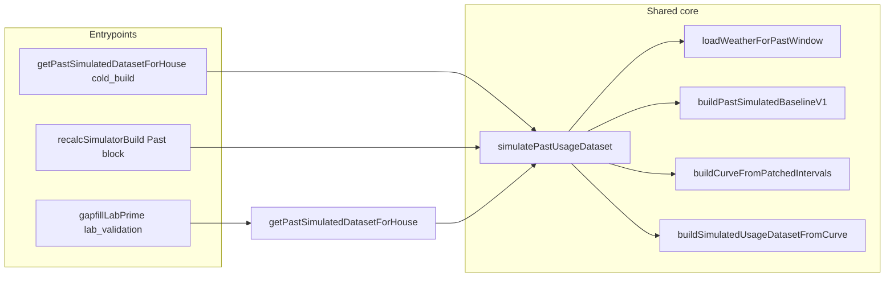

# Past Shared-Core Unification Plan

## Overview

Single internal entrypoint for Past simulation and GapFill scoring, with one shared weather loader, one shared artifact identity/fingerprint, and truthful weather provenance. GapFill is scoring/reporting only and must consume output from the shared Past simulator path (cached artifact restore or fresh shared build), not a separate compare artifact.

## Implemented wiring (verification checklist still open)

- **Shared module** `modules/simulatedUsage/simulatePastUsageDataset.ts`
  - `simulatePastUsageDataset(args)`: single entrypoint; accepts houseId, userId, esiid, startDate, endDate, timezone, travelRanges, buildInputs, buildPathKind (`cold_build` | `recalc` | `lab_validation`), optional preloaded actualIntervals.
  - `loadWeatherForPastWindow(args)`: single weather loader; uses house lat/lng to call `ensureHouseWeatherBackfill` + `getHouseWeatherDays` or `ensureHouseWeatherStubbed` + `getHouseWeatherDays`; returns actualWxByDateKey, normalWxByDateKey, and provenance (weatherKindUsed, weatherSourceSummary, weatherFallbackReason, weatherProviderName, weatherCoverageStart/End, weatherStubRowCount, weatherActualRowCount).
  - Weather fallback reasons: `missing_lat_lng`, `api_failure_or_no_data`, `partial_coverage`, `unknown` (or null when full actual).
- **service.ts**
  - `getPastSimulatedDatasetForHouse`: delegates to `simulatePastUsageDataset(..., buildPathKind: 'cold_build' | 'lab_validation')`; preserves overlay and dailyWeather; optional `buildPathKind` parameter.
  - Recalc Past block: uses `simulatePastUsageDataset(..., buildPathKind: 'recalc')`; sets pastPatchedCurve and monthlyTotalsKwhByMonth from returned stitchedCurve.
  - Cache restore: sets `buildPathKind: 'cache_restore'`; when cached weather provenance missing, sets `weatherSourceSummary` and `weatherFallbackReason` to `'unknown'`.
- **modules/weather/backfill.ts**
  - `ensureHouseWeatherBackfill` returns `{ fetched, stubbed, skippedLatLng?: boolean }`; `skippedLatLng: true` when house has no lat/lng (no API call).
- **GapFill Lab**
  - `lib/admin/gapfillLabPrime.ts` calls `getPastSimulatedDatasetForHouse` with `buildPathKind: 'lab_validation'`; production Past path inherits shared core.
- **Metadata**
  - dataset.meta includes: buildPathKind, sourceOfDaySimulationCore, simVersion, derivationVersion, weatherKindUsed, weatherSourceSummary, weatherFallbackReason, weatherProviderName, weatherCoverageStart/End, weatherStubRowCount, weatherActualRowCount, dailyRowCount, intervalCount, coverageStart/End, actualDayCount, simulatedDayCount, stitchedDayCount, actualIntervalsCount, referenceDaysCount, shapeMonthsPresent, excludedDateKeysCount, leadingMissingDaysCount, usageShapeProfileDiag, etc.
- **UsageDashboard**
  - `getWeatherBasisLabel(meta)` surfaces weatherFallbackReason for stub/mixed (e.g. "no coordinates", "partial coverage", "API unavailable"); does not imply actual weather when summary is stub_only, mixed, or unknown.

## Active architecture authority

- Past Sim and GapFill compare use the same shared artifact identity/fingerprint and the same shared simulator logic.
- Travel/vacant days are the only excluded ownership days for the shared artifact fingerprint.
- Test days remain included in the shared artifact population and are only selected by GapFill for scoring against actual usage.
- GapFill must consume simulated intervals from shared simulator output for that artifact identity (cached restore or fresh shared build). It must not create a compare artifact, create a compare-mask fingerprint, change artifact identity, or rebuild simulated intervals locally.
- GapFill default scoring mode is selected-day fresh shared execution (`compareFreshMode=selected_days`) with artifact-backed display output retained.
- Lightweight selected-days `compare_core` must reduce early: keep selected-day actual/simulated intervals, canonical artifact simulated-day totals, and compact truth metadata only; do not serialize full-window diagnostics/weather arrays in the core response.
- DB travel/vacant dates are not guardrail-only metadata in compare-core: the shared/service layer must pull the bounded DB travel set, execute those dates through the same shared simulator family used by Past Sim, and validate canonical artifact simulated-day totals against fresh shared compare day totals.
- Compare-core must also return compact scored-day weather truth from the shared compare/service execution for the scored local dates only; route/UI consumers must not reconstruct scored-day weather independently.
- For selected-days scored actual rows, artifact simulated-day parity is `not_applicable_scored_actual_days` unless a canonical artifact simulated-day reference actually exists for those dates; do not count missing simulated references against scored actual-day parity.
- Full-window fresh shared compare remains available as an explicit heavy proof mode (`compareFreshMode=full_window`), not a default route path.
- Heavy diagnostics/report retries should use compact merge-only response shaping so the heavy step returns diagnostics/report data without re-serializing the full core payload.
- Heavy report expands the same compact scored-day weather truth into richer weather inspection/report output; no separate route-only weather path is allowed.
- Compare success must not claim shared-path parity for DB travel/vacant validation unless both canonical artifact simulated-day totals and fresh shared compare day totals exist for those dates; exact-identity-sensitive runs must fail explicitly when that proof cannot be established.
- Artifact fingerprint ownership and usage-shape identity contracts are unchanged by this step; deferred profile/hash contract work remains separate.
- Authoritative shared simulator call chain:
  - `getPastSimulatedDatasetForHouse`
  - `simulatePastUsageDataset`
  - `loadWeatherForPastWindow`
  - `buildPastSimulatedBaselineV1`
  - `buildCurveFromPatchedIntervals`
  - `buildSimulatedUsageDatasetFromCurve`

Modeling guidance alignment:
- Canonical simulation-logic reference is `docs/USAGE_SIMULATION_PLAN.md`.
- For observed-history reconstruction in this shared Past core, empirical interval history + weather/day-time response is primary.
- Home/appliance/occupancy details remain required and normalized, but are supportive priors/fallback in observed-history mode; they are primary in overlay and synthetic/sparse-data modes.

## LEGACY / NON-AUTHORITATIVE

- `gapfill_test_days_profile` may appear as a historical validation label in older notes or diagnostics. It does not represent a separate simulation engine, separate artifact, separate fingerprint, or separate ownership scope.

## Call graph (production Past)

## Post-implementation verification checklist

- [ ] **Cold build vs recalc parity**: Same house/window/travel produces same intervals and monthly totals whether built via cold (house fetch) or via recalc; both use `simulatePastUsageDataset` with `useUtcMonth: true`.
- [ ] **Cache restore parity**: Restored dataset has same daily/monthly as when first built; `buildPathKind: 'cache_restore'`; no re-run of weather backfill on restore.
- [ ] **Truthful missing_lat_lng stub labeling**: When house has no lat/lng, UI shows stub weather and fallback reason (e.g. "no coordinates"); `weatherSourceSummary` = stub_only, `weatherFallbackReason` = missing_lat_lng.
- [ ] **Truthful partial coverage labeling**: When some days have actual weather and some stub, UI shows mixed and fallback reason (e.g. "partial coverage") where applicable.
- [ ] **GapFill scoring parity**: Selected test days are scored from the same shared artifact and same shared simulator output used by Past production; reports may expose parity metadata but must not imply a separate engine or artifact.
