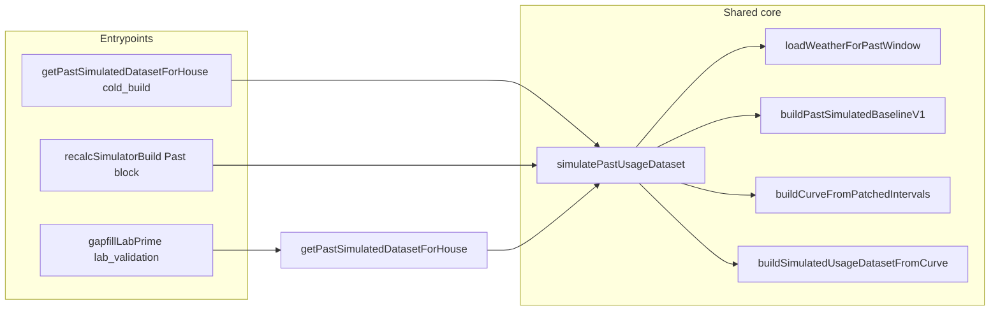

# Past Shared-Core Unification Plan

## Overview

Single internal entrypoint for Past simulation (cold build, recalc, GapFill Lab production path) with one shared weather loader and truthful weather provenance.

## Implemented

- **Shared module** `modules/simulatedUsage/simulatePastUsageDataset.ts`
  - `simulatePastUsageDataset(args)`: single entrypoint; accepts houseId, userId, esiid, startDate, endDate, timezone, travelRanges, buildInputs, buildPathKind (`cold_build` | `recalc` | `lab_validation`), optional preloaded actualIntervals.
  - `loadWeatherForPastWindow(args)`: single weather loader; uses house lat/lng to call `ensureHouseWeatherBackfill` + `getHouseWeatherDays` or `ensureHouseWeatherStubbed` + `getHouseWeatherDays`; returns actualWxByDateKey, normalWxByDateKey, and provenance (weatherKindUsed, weatherSourceSummary, weatherFallbackReason, weatherProviderName, weatherCoverageStart/End, weatherStubRowCount, weatherActualRowCount).
  - Weather fallback reasons: `missing_lat_lng`, `api_failure_or_no_data`, `partial_coverage`, `unknown` (or null when full actual).
- **service.ts**
  - `getPastSimulatedDatasetForHouse`: delegates to `simulatePastUsageDataset(..., buildPathKind: 'cold_build' | 'lab_validation')`; preserves overlay and dailyWeather; optional `buildPathKind` parameter.
  - Recalc Past block: uses `simulatePastUsageDataset(..., buildPathKind: 'recalc')`; sets pastPatchedCurve and monthlyTotalsKwhByMonth from returned stitchedCurve.
  - Cache restore: sets `buildPathKind: 'cache_restore'`; when cached weather provenance missing, sets `weatherSourceSummary` and `weatherFallbackReason` to `'unknown'`.
- **modules/weather/backfill.ts**
  - `ensureHouseWeatherBackfill` returns `{ fetched, stubbed, skippedLatLng?: boolean }`; `skippedLatLng: true` when house has no lat/lng (no API call).
- **GapFill Lab**
  - `lib/admin/gapfillLabPrime.ts` calls `getPastSimulatedDatasetForHouse` with `buildPathKind: 'lab_validation'`; production Past path inherits shared core.
- **Metadata**
  - dataset.meta includes: buildPathKind, sourceOfDaySimulationCore, simVersion, derivationVersion, weatherKindUsed, weatherSourceSummary, weatherFallbackReason, weatherProviderName, weatherCoverageStart/End, weatherStubRowCount, weatherActualRowCount, dailyRowCount, intervalCount, coverageStart/End, actualDayCount, simulatedDayCount, stitchedDayCount, actualIntervalsCount, referenceDaysCount, shapeMonthsPresent, excludedDateKeysCount, leadingMissingDaysCount, usageShapeProfileDiag, etc.
- **UsageDashboard**
  - `getWeatherBasisLabel(meta)` surfaces weatherFallbackReason for stub/mixed (e.g. "no coordinates", "partial coverage", "API unavailable"); does not imply actual weather when summary is stub_only, mixed, or unknown.

## Still separate / pending

- **gapfill_test_days_profile**: Lab path name for the validation pipeline (getActualIntervalsForRange → simulateIntervalsForTestDaysFromUsageShapeProfile → computeGapFillMetrics). **Day-total logic is shared**: when using auto_built_lite or profile with lite strength, test-day totals are produced by **getPastDayResultOnly** in `modules/simulatedUsage/pastDaySimulator.ts` (same as Past production’s **simulatePastDay**). So Lab and Past use the **same day-simulation core** (`shared_past_day_simulator`); only the pipeline entry and shape source (profile vs reference-derived) differ. Admin report now exposes `daySimulationCore` and `sameEngineAsPastProduction: true` for the gapfill path.

## Call graph (production Past)

## Post-implementation verification checklist

- [ ] **Cold build vs recalc parity**: Same house/window/travel produces same intervals and monthly totals whether built via cold (house fetch) or via recalc; both use `simulatePastUsageDataset` with `useUtcMonth: true`.
- [ ] **Cache restore parity**: Restored dataset has same daily/monthly as when first built; `buildPathKind: 'cache_restore'`; no re-run of weather backfill on restore.
- [ ] **Truthful missing_lat_lng stub labeling**: When house has no lat/lng, UI shows stub weather and fallback reason (e.g. "no coordinates"); `weatherSourceSummary` = stub_only, `weatherFallbackReason` = missing_lat_lng.
- [ ] **Truthful partial coverage labeling**: When some days have actual weather and some stub, UI shows mixed and fallback reason (e.g. "partial coverage") where applicable.
- [ ] **Lab test-days path**: Day totals use **shared_past_day_simulator** (getPastDayResultOnly); report shows daySimulationCore and sameEngineAsPastProduction: true. Pipeline name remains gapfill_test_days_profile.
