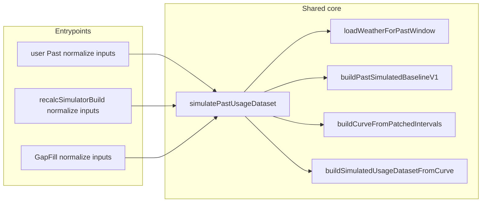

# Past Shared-Core Unification Plan

## Overview

Single internal entrypoint for Past simulation and GapFill scoring, with one shared weather loader, one shared artifact identity/fingerprint, and truthful weather provenance. GapFill is scoring/reporting only and must consume output from the shared Past simulator path after persistence, not a separate compare artifact or compare-side fresh sim path.

## Manual-Usage Alignment (Authoritative)

- Shared producer path after normalization remains the rule.
- USER MANUAL MONTHLY, USER MANUAL ANNUAL, and GapFill source-derived manual modes are distinct only in input semantics and pre-lockbox normalization.
- USER MANUAL MONTHLY starts as a bill-cycle input chart anchored by the latest entered bill end date. That Stage 1 input chart must not be collapsed into the normalized shared Past Sim window.
- USER MANUAL ANNUAL starts as billing-date context plus a single annual total. It must not render a pre-sim usage chart.
- The latest entered bill end date is the last day of the Stage 1 monthly input sequence, and that sequence runs backward by bill-cycle months.
- Current runtime keeps Stage 1 bill-range semantics with additive `statementRanges[]` bill-period constraint inputs plus reconciliation metadata for monthly payloads and a shared annual summary presentation for annual payloads while Stage 2 still uses the shared normalized Past contract.
- GapFill monthly-from-source starts from source-derived monthly anchors used for grading/tuning. It is not the same input semantic as USER MANUAL MONTHLY.
- USER MANUAL MONTHLY and USER MANUAL ANNUAL are still travel/vacant-aware. Travel/vacant behavior does not belong only to GapFill monthly-from-source.
- Admin Manual Monthly Lab uses read-only source-home context plus a writable isolated test home. Usable source manual payload wins by default; deterministic SMT-derived seeded bill ranges are fallback/reset convenience only.
- Manual Usage Lab and GapFill stay separate surfaces; shared ownership here is Stage 1/pre-lockbox helper logic only.
- Shared monthly+annual Stage 1 helper ownership now lives in `modules/manualUsage/prefill.ts`, and GapFill `MONTHLY_FROM_SOURCE_INTERVALS` / `ANNUAL_FROM_SOURCE_INTERVALS` must use that same helper family before the shared lockbox path.
- After normalization, both paths must use the same shared weather loader, lockbox producer path, persistence path, and artifact read path.
- Manual-mode recalc/readback is now split explicitly: recalc returns once the canonical artifact is ready, and richer manual compare/reconciliation is loaded from persisted readback using the exact `canonicalArtifactInputHash` when present.
- Shared Past Sim now derives shared bill-period targets before shaping:
  - non-excluded bill periods stay eligible parity constraints
  - travel-touched bill periods stay visible but non-scored
  - for Manual Monthly, those travel-touched bill periods are also excluded from shared weather-evidence fitting and totals-to-match shaping; only eligible non-travel bill periods drive low-data manual evidence
- Statement/bill ranges remain Stage 1 bill-period constraint inputs plus reconciliation metadata. They may shape Stage 2 constraints, but they are not promoted into travel-vacant ownership, incomplete-meter ownership, or silent exclusions.
- Shared Past Sim must fill missing bill-cycle months, excluded travel/vacant days, and other required simulated periods after normalization. Blank input-chart months are an input-state concept, not the final artifact contract.
- Manual monthly user Past and admin manual-monthly lab are required to stay identical from normalized input submission through chart rendering.
- Allowed admin-only divergence begins only after the shared Past result is accepted for display:
  - bill-period parity compare
  - extra diagnostics
  - read-only operator wrappers
- Not allowed:
  - different post-lockbox failure points
  - different artifact/read acceptance gates
  - different chart payload generation before the shared dashboard renders

## Implemented wiring (verification checklist still open)

- **Shared module** `modules/simulatedUsage/simulatePastUsageDataset.ts`
  - `simulatePastUsageDataset(args)`: single producer entrypoint; accepts houseId, userId, esiid, startDate, endDate, timezone, travelRanges, buildInputs, buildPathKind, optional preloaded actualIntervals.
  - `loadWeatherForPastWindow(args)`: single weather loader; reads persisted daily weather first and short-circuits when canonical dates are fully covered by non-stub `ACTUAL_LAST_YEAR` rows, otherwise backfills/repairs only missing or `STUB_V1` dates before returning actualWxByDateKey, normalWxByDateKey, and provenance (weatherKindUsed, weatherSourceSummary, weatherFallbackReason, weatherProviderName, weatherCoverageStart/End, weatherStubRowCount, weatherActualRowCount).
  - Weather fallback reasons: `missing_lat_lng`, `api_failure_or_no_data`, `partial_coverage`, `unknown` (or null when full actual).
- **service.ts**
  - `getPastSimulatedDatasetForHouse`: delegates to `simulatePastUsageDataset(..., buildPathKind: 'recalc')`; preserves overlay and dailyWeather.
  - Recalc Past block: also uses `simulatePastUsageDataset(..., buildPathKind: 'recalc')`; sets pastPatchedCurve and monthlyTotalsKwhByMonth from returned stitchedCurve.
  - Cache restore: sets `buildPathKind: 'cache_restore'`; when cached weather provenance missing, sets `weatherSourceSummary` and `weatherFallbackReason` to `'unknown'`.
  - **Stale daily prevention:** After decoding stored `intervals15`, `reconcileRestoredPastDatasetFromDecodedIntervals` overwrites display aggregates from interval truth and uses artifact **meta** (when explicit simulated-day fields exist) for which dates are simulated—so a new run’s persisted meta is not merged with leftover `SIMULATED` rows from an older save. Legacy artifacts without those meta fields still derive simulated membership from stored `daily` and, for `sourceDetail`, from meta keys when present else from the pre-reconcile daily row.
  - **User Past compare:** `attachValidationCompareProjection` enriches each `validationCompareRow` with **optional** same-date **`dailyWeather`** fields (read-only context aligned to the Past daily table). The Usage page compare section is **collapsed by default** with an inline expand control; scoring metrics and compare truth are unchanged.
- **`modules/manualUsage/statementRanges.ts` + `modules/manualUsage/readModel.ts`**
  - Shared manual helpers now own Stage 1 presentation plus Stage 2 bill-period target derivation for both monthly and annual payloads.
  - `buildManualBillPeriodTargets()` is the shared authority for normalized bill periods, entered totals, eligibility flags, and travel-overlap exclusions.
  - Shared manual readback now publishes one canonical bill-period-first compare contract from persisted artifacts:
    - `ManualBillPeriodTarget[]`
    - `manualBillPeriodTotalsKwhById`
    - shared bill-period compare rows consumed by user/admin manual surfaces and GapFill manual compare
- **modules/usageSimulator/build.ts**
  - Manual modes now emit `manualBillPeriods` and `manualBillPeriodTotalsKwhById` in shared build inputs instead of relying on month-first metadata only.
- **modules/simulatedUsage/simulatePastUsageDataset.ts**
  - In low-data shared Past mode, eligible manual bill periods now reserve their dates inside the shaping/reference pool.
  - Travel-touched bill periods are excluded from parity shaping rather than aborting the build.
  - Lean manual/low-data runs suppress full actual-interval carry-through, avoid exact-interval-style keep-ref expansion, and renormalize manual bill periods with a bounded indexed pass after baseline return.
  - Constrained manual non-travel modeled days now stay on manual-constrained ownership semantics even when the resolved constrained path lands on `whole_home_only`; explicit travel ranges remain the only travel/vacant ownership source.
- Manual-monthly runs now attach `manualMonthlyWeatherEvidenceSummary`, derived from eligible non-travel Stage 1 bill-period targets plus actual weather pressure, to the shared artifact metadata. That summary also records excluded travel-touched bill periods, eligible/travel day counts, the weather inputs used, and whole-home/prior fallback weight.
- Shared constrained artifact diagnostics must also retain the bill-period-first contract (`manualBillPeriods`, `manualBillPeriodTotalsKwhById`) and any attached source-derived monthly anchors for GapFill monthly-from-source readback/explainer surfaces.
- **UsageDashboard / ManualMonthlyLab**
  - Stage 1 monthly surfaces render bill-period rows only.
  - Stage 1 annual surfaces render billing-date context plus annual total only, with no pre-sim chart.
  - Stage 2 admin read surfaces show the standard Past dashboard plus a bill-period parity compare where excluded rows stay visible but non-scored.
  - The standard Past dashboard on the admin lab must come from the same shared service/read/projection path the user Past page uses for the same normalized manual scenario.
- **modules/weather/backfill.ts**
  - `ensureHouseWeatherBackfill` returns `{ fetched, stubbed, skippedLatLng?: boolean }`; `skippedLatLng: true` when house has no lat/lng (no API call).
- **GapFill Lab**
  - Artifact-producing rebuilds normalize inputs then call the same shared recalc producer path before persistence; GapFill diagnostics may differ only after stored outputs exist.
  - GapFill Actual Home is the exact same user Past Sim flow with a different trigger/view surface only; it stays on `userValidationPolicy` and the shared persisted read/display path.
  - GapFill Test Home may fork only before lockbox entry: admin-owned validation policy plus usage input mode (`EXACT_INTERVALS`, `MANUAL_MONTHLY`, `MONTHLY_FROM_SOURCE_INTERVALS`, `ANNUAL_FROM_SOURCE_INTERVALS`, `PROFILE_ONLY_NEW_BUILD`). After normalization it must use the same lockbox producer chain and artifact writer.
  - GapFill manual monthly/manual annual use the same shared dispatch + persisted readback pattern as Manual Monthly Lab; compare/reconciliation is read-only, artifact-backed, and derived from the same shared bill-period-first read model after readback.
- GapFill Actual House summary/monthly/diagnostic panels must use that same shared persisted actual-house read path too; if the shared artifact/readback has actual-house truth, the UI must project it from there rather than route-local placeholders.
- Actual compare totals must come from that same shared actual-house read path as the Actual House monthly display; do not mix a second annual aggregate or alternate monthly source without explicit labeling.
- Manual Lab remains the authority for manual-entry Stage 1 semantics, so GapFill manual monthly/manual annual now resolve the same shared manual payload contract before recalc and persist that contract onto the reusable test home before the shared producer runs.
  - Manual monthly Stage 2 input is totals-only. Source actual usage may seed month/bill-period totals, but raw intervals, source daily rows, and actual-derived intraday shapes stay out of the manual-monthly simulation path.
  - GapFill `MANUAL_MONTHLY` is the pure manual monthly variant for interval-backed houses: saved manual payload drives Stage 2, source actual usage is compare-only, and no source-derived monthly anchors survive as active Stage 2 drivers.
  - Manual monthly source-backed periods that overlap travel/vacant dates lose source-truth ownership and are filled by the shared simulation path instead of reusing actual-derived totals.
  - Manual annual Stage 2 input is annual-only. The annual total plus anchor window enters the simulator, and month/day/hour allocation is derived inside the shared simulation path rather than precomputed upstream.
- Manual compare Actual kWh must come from shared actual-house truth when available, summed over the shared displayed bill periods; `0.00` is not a valid missing-truth fallback.
- Travel/vacant simulated days and manual-constrained simulated days stay on the same shared day-simulation family and shaping path. Their difference is ownership/constraint labeling, not a second flat or frozen day engine.
  - Daily curve compare/tuning diagnostics belong on GapFill/admin tuning surfaces only, not on the Manual Usage Lab flow/debug surface.
  - USER MANUAL MONTHLY remains a distinct user-input semantic before normalization. GapFill `MANUAL_MONTHLY` is the pure manual monthly test-home variant, while GapFill `MONTHLY_FROM_SOURCE_INTERVALS` is the explicit source-derived monthly variant. Those two modes must remain separately labeled.
- On `MANUAL_TOTALS`, manual payload travel ranges are now the canonical manual travel input. Source/test-home DB travel ranges remain useful parity context, but they do not become a second manual travel truth owner.
  - Weather logic is pre-lockbox only: user Past owns `userWeatherLogicSetting`; GapFill Actual/Test share `gapfillWeatherLogicSetting` for a run; the shared resolver and lockbox chain stay the same after normalization.
- **Metadata**
  - dataset.meta includes: buildPathKind, sourceOfDaySimulationCore, simVersion, derivationVersion, weatherKindUsed, weatherSourceSummary, weatherFallbackReason, weatherProviderName, weatherCoverageStart/End, weatherStubRowCount, weatherActualRowCount, dailyRowCount, intervalCount, coverageStart/End, actualDayCount, simulatedDayCount, stitchedDayCount, actualIntervalsCount, referenceDaysCount, shapeMonthsPresent, excludedDateKeysCount, leadingMissingDaysCount, usageShapeProfileDiag, etc.
  - Manual constrained shared runs may also carry `manualMonthlyInputState`, `manualMonthlyWeatherEvidenceSummary`, and `SIMULATED_MANUAL_CONSTRAINED` source-detail mapping on the artifact.
  - Shared parity/tuning diagnostics now normalize to one contract: `identityContext`, `sourceTruthContext`, `lockboxExecutionSummary`, `projectionReadSummary`, and `tuningSummary`.
- **UsageDashboard**
  - `getWeatherBasisLabel(meta)` surfaces weatherFallbackReason for stub/mixed (e.g. "no coordinates", "partial coverage", "API unavailable"); does not imply actual weather when summary is stub_only, mixed, or unknown.

## Target: Gap-Fill data pool and holdout scoring (product intent)

Authoritative expanded write-up: `docs/USAGE_SIMULATION_PLAN.md` → **Gap-Fill Lab: Target architecture (data pool, single run, scoring)**.

Summary:

- **Reference / good-data pool** for the shared Past sim includes **test compare** days’ **actual** intervals (they are trustworthy at-home usage). **Only** travel/vacant (and similar exclusions) are **withheld** from that pool as bad reference signal.
- **Travel/vacant** days are **not** in the pool; they are **filled** by the same shared sim using the **rest** of the good window.
- **One** shared producer execution writes the canonical Past artifact. Gap-Fill may launch that shared recalc, but compare/parity consume the persisted artifact only.
- **Target for test rows:** test-day simulated values in Gap-Fill grading come from persisted canonical artifact fields and compare sidecars produced by the shared lockbox run, not from a Gap-Fill-owned fresh compare path.

### Stitch UI vs compare UI (contract)

- **Stitched Past chart/table (Usage dashboard):** After `getSimulatedUsageForHouseScenario`, **`projectBaselineFromCanonicalDataset`** replaces **validation-only** dates with **actual meter** daily totals and labels (`ACTUAL_VALIDATION_TEST_DAY`). **TRAVEL_VACANT** modeled days remain **`SIMULATED_TRAVEL_VACANT`** in stitch. If a cached artifact omitted `meta.validationOnlyDateKeysLocal`, **`rehydrateValidationCompareMetaFromBuildInputsForRead`** restores keys from `usageSimulatorBuild.buildInputs` before projection + **`attachValidationCompareProjection`** so compare rows exist and stitch labels are not stuck on `SIMULATED_TEST_DAY`. The daily **Source** column distinguishes incomplete-meter and leading-missing simulated fills (from `simulatedReasonCode` / persisted `simulatedSourceDetailByDate`) from travel, test (pre-projection), and OTHER. Chart and table both consume the same post-projection **`dataset.daily`** / **`series.daily`** (including **`source`/`sourceDetail`** on the series fallback path).
- **Compare panel:** Still uses **`validationCompareRows`** / **`validationCompareMetrics`** from **`attachValidationCompareProjection`** (canonical simulated-day totals in meta)—not stitched daily labels.

## What changed to match the target (engineering checklist)

- **Gap-Fill compare path:** producer ownership remains shared through `recalcSimulatorBuild` / `simulatePastUsageDataset` and persisted in canonical artifact storage. GapFill compare reads those stored outputs (including simulated test-day outputs) from the same canonical family used by user-facing Past.
- **GapFill admin canonical recalc route (`run_test_home_canonical_recalc`):** After variable collection and normalization, the test house enters the same shared Past Sim recalc/persist chain as a normal user Past run. There is no special test-house simulator or artifact writer path after lockbox entry.
- **UI / API truth:** GapFill actual-house and test-house panels read the same persisted Past artifact family and shared presentation modules used by the user page. Compare truth rows/metrics come from stored canonical compare sidecar fields (`validationCompareRows` / `validationCompareMetrics`) and persisted canonical day totals only.
- **Docs/tests:** Route and service artifact tests assert persisted-artifact ownership and shared-window rules; shared-window ownership rules unchanged.

## Active architecture authority

- Past Sim and GapFill compare use the same shared artifact identity/fingerprint and the same shared simulator logic.
- Travel/vacant days are the only excluded ownership days for the shared artifact fingerprint.
- Test days remain included in the shared artifact population and are only selected by GapFill for scoring against actual usage.
- GapFill must consume canonical stored sim outputs for compare truth and must not create a compare artifact, create a compare-mask fingerprint, change artifact identity, or rebuild a second compare truth path locally.
- Optional fresh/parity diagnostics are additive analytics only and must never replace canonical stored compare truth rows. If user-pipeline parity is enabled, it remains read-only diagnostics over persisted reads.
- GapFill compare reads compact persisted truth only: selected-day actual intervals, canonical artifact simulated-day totals, compare sidecar rows/metrics, and compact trace metadata.
- DB travel/vacant parity is a post-persist analysis concern: it may validate persisted canonical artifact totals, but it must not trigger a Gap-Fill-owned selected-days/full-window compare simulation path.
- Compare-core must return compact scored-day weather truth from persisted read models only; route/UI consumers must not reconstruct scored-day weather independently.
- Compare-core weather enrichment must reuse the same compare-row weather helper used by user Past display rows when matching daily weather already exists on the persisted read model.
- Scored-day compare/sim integrity: simulated-side fields come only from persisted canonical shared simulated outputs and artifact canonical simulated-day totals. **ACTUAL must never substitute for simulated** on the simulated side; missing simulated references stay missing with explicit `missing_expected_reference` / reason codes, not silent recovery.
- Heavy diagnostics/report retries should use compact merge-only response shaping so the heavy step returns diagnostics/report data without re-serializing the full core payload.
- Heavy report expands the same compact scored-day weather truth into richer weather inspection/report output; no separate route-only weather path is allowed.
- Compare success must not claim parity for DB travel/vacant validation unless the persisted artifact contains the canonical totals needed for that analysis; exact-identity-sensitive runs must fail explicitly when that proof cannot be established.
- When `artifactIdentitySource=same_run_artifact_ensure` and exact compare is requested, the handoff must stay on the exact rebuilt artifact identity: no latest-scenario fallback is allowed.
- Rebuilt shared artifacts must persist `canonicalArtifactSimulatedDayTotalsByDate` on the exact saved row, and exact compare/parity reads must source DB travel/vacant artifact references from that canonical field rather than display rows.
- Artifact fingerprint ownership and usage-shape identity contracts are unchanged by this step; deferred profile/hash contract work remains separate.
- Current branch caveat: canonical simulated-day totals are owned by `buildSimulatedUsageDatasetFromCurve()` and consumed from persisted artifact fields. The remaining narrow caveat is historical artifact provenance/readback hardening, not an active Gap-Fill authority split.
- Current branch caveat: shared window/date ownership is still correct and must stay locked. Compare identity uses `resolveWindowFromBuildInputsForPastIdentity()`, metadata/report coverage uses `resolveCanonicalUsage365CoverageWindow()`, and scored/test dates must not widen travel/vacant exclusion ownership or artifact identity.
- Current branch caveat: stronger monthly weather evidence, stronger baseload inference, and stronger HVAC-share inference still remain future manual-monthly work after this shared-contract/ownership pass.
### Plan Change (2026-04) — Manual Monthly Canonical Actual + Active Contract Pass
- Canonical actual-house artifact/readback truth is the only valid owner for manual compare actual-reference. Shared compare/read surfaces must not switch annual totals, monthly actuals, or bill-period Actual kWh onto a second aggregate path when the actual-house artifact already carries that truth.
- Active `MANUAL_MONTHLY` contract ownership is now exact-artifact scoped: the Stage 1 payload written for the run must carry the same saved/effective travel contract selected for recalc, and stale saved payload travel ranges must not be surfaced as active artifact truth.
- Shared manual low-data travel behavior must remain on the same modeled-day family as manual-constrained days. Travel/vacant weather evidence may be weaker, but the runtime must keep the same shared weather/day-shape selector family instead of dropping onto a separate frozen-value engine.
- This Plan Change overrides any prior wording that tolerated alternate compare totals, stale active travel-contract readback, or separate flat travel-day behavior.
- Authoritative shared simulator call chain:
  - `getPastSimulatedDatasetForHouse`
  - `simulatePastUsageDataset`
  - `loadWeatherForPastWindow`
  - `buildPastSimulatedBaselineV1`
  - `buildCurveFromPatchedIntervals`
  - `buildSimulatedUsageDatasetFromCurve`

Modeling guidance alignment:
- Canonical simulation-logic reference is `docs/USAGE_SIMULATION_PLAN.md`.
- For observed-history reconstruction in this shared Past core, empirical interval history + weather/day-time response is primary.
- Home/appliance/occupancy details remain required and normalized, but are supportive priors/fallback in observed-history mode; they are primary in overlay and synthetic/sparse-data modes.

## Current runtime state + next stabilization follow-up

- Current runtime state now includes compare-run persistence from `compare_core`: compare-core creates a durable compare-run record keyed by `compareRunId` and finalizes a compact compare snapshot on successful completion.
- `compareRunId` handoff is implemented in current runtime (`compareRunId`, `compareRunStatus`, `compareRunSnapshotReady`).
- Staged snapshot-read-only heavy readers are now implemented in current runtime:
  - `compare_heavy_manifest`
  - `compare_heavy_parity`
  - `compare_heavy_scored_days`
- Canonical admin heavy follow-up now reads staged snapshot projections via `compareRunId` readers.
- Legacy `compare_heavy` compatibility may still exist, but it is not the canonical admin heavy path.
- Next work is still narrow: optional admin polish remains, but strict shared-sim follow-up on the current branch is now limited to historical-artifact provenance/readback hardening without changing shared-window ownership.
- GapFill remains scoring/reporting-only and must continue using the shared simulation/artifact/weather path; snapshot work changes orchestration/persistence only, not modeling ownership.

## LEGACY / NON-AUTHORITATIVE

- `gapfill_test_days_profile` may appear as a historical validation label in older notes or diagnostics. It does not represent a separate simulation engine, separate artifact, separate fingerprint, or separate ownership scope.

## Call graph (production Past)

## Post-implementation verification checklist

- [ ] **Single producer parity**: Same normalized house/window/travel/test-day inputs produce the same labeled simulated-day outputs regardless of user vs admin entrypoint; both must execute the same shared pre-DB producer chain.
- [ ] **Cache restore parity**: Restored dataset has same daily/monthly as when first built; `buildPathKind: 'cache_restore'`; no re-run of weather backfill on restore.
- [ ] **Truthful missing_lat_lng stub labeling**: When house has no lat/lng, UI shows stub weather and fallback reason (e.g. "no coordinates"); `weatherSourceSummary` = stub_only, `weatherFallbackReason` = missing_lat_lng.
- [ ] **Truthful partial coverage labeling**: When some days have actual weather and some stub, UI shows mixed and fallback reason (e.g. "partial coverage") where applicable.
- [ ] **GapFill scoring parity**: Selected test days are scored from the same shared artifact and same shared simulator output used by Past production; reports may expose parity metadata but must not imply a separate engine or artifact.

Where earlier sections in this file conflict with the following, the following section takes precedence.

## AUTHORITATIVE SIMULATOR ARCHITECTURE OVERRIDE

This section overrides any older contradictory guidance in this file.

This override applies to every simulator execution mode and entrypoint, without exception, including:
- initial run
- cold start
- cold build
- cache miss rebuild
- allow_rebuild
- refresh
- explicit recalc
- admin canonical recalc
- user-triggered rebuild
- artifact refresh
- artifact ensure
- snapshot-producing rebuilds
- any future renamed equivalent of these modes

No execution mode is exempt from the rules below.

### 1) One shared simulator producer path only

User Past Sim and GapFill may begin with different user inputs, but after input normalization they must enter the exact same shared simulator producer path.

There must not be:
- a separate user producer path
- a separate admin producer path
- a separate GapFill producer truth path
- a separate "cold_build truth" path for stored simulator outputs
- a separate "recalc truth" path for stored simulator outputs
- a separate "refresh truth" path for stored simulator outputs
- a separate "allow_rebuild truth" path for stored simulator outputs
- a separate "artifact ensure truth" path for stored simulator outputs

Input values may differ. Producer code path may not differ.

### 2) Shared producer output types

The shared simulator producer path must derive and label simulated day outputs before downstream consumers use them.

The labeled simulated day output categories are:

- `TRAVEL_VACANT`
- `TEST`

These labels are producer-owned truth, not UI-only annotations.

### 3) Fingerprint ownership rule

Fingerprint ownership must follow this exact rule:

- exclude only `TRAVEL_VACANT` days from the usage fingerprint
- keep actual usage for `TEST` days included in the usage fingerprint

`TEST` days are not excluded from the usage fingerprint.

This fingerprint rule applies in every simulator execution mode listed above.

### 4) Storage rule

After the shared simulator producer derives simulated day outputs, those outputs become the stored simulator truth used by downstream consumers.

Downstream consumers must not replace this with a separate admin-only simulated truth source.

This storage rule applies regardless of whether the run began as a cold start, refresh, allow_rebuild, explicit recalc, artifact ensure, or any other execution mode.

### 5) Downstream split of responsibilities

After simulated day outputs are produced and stored:

- `stitch` consumes `ACTUAL` days plus `TRAVEL_VACANT` simulated days only to build the stitched Past chart
- `compare` consumes `TEST` simulated days only and compares them against actual interval data for those same test days

`TEST` simulated days do not belong in the stitched Past chart.

`TRAVEL_VACANT` simulated days do not belong in the test-day compare set.

This downstream split applies in every simulator execution mode listed above.

### 6) User page and GapFill truth source

User Past Sim and GapFill must both read the same stored simulation truth and the same stored compare truth when available.

GapFill may add deeper analytics, diagnostics, and tuning surfaces on top of that shared truth, but GapFill must not own a separate simulator truth source or a separate compare truth source.

This is true for cold starts, refreshes, rebuilds, recalc runs, artifact refreshes, and all other simulator entrypoints.

### 7) Compare ownership rule

Compare truth must remain artifact-backed or stored-output-backed. Fresh admin calculations may exist only as diagnostics and must never replace compare truth.

If fresh diagnostics are shown, they must be clearly treated as diagnostics only.

This compare ownership rule applies in every simulator execution mode listed above.

### 8) Selected-days fresh diagnostics rule

In `selected_days` fresh diagnostics mode, scored day totals must come from canonical simulator-owned day totals.

They must not be re-derived by summing intervals in selected-days mode.

Canonical simulator-owned scored day totals are the source of truth for selected-days fresh diagnostics.

### 9) No pre-DB branch divergence

Any divergence between User Past Sim and GapFill before simulated day outputs are written to storage is a bug.

Differences are allowed only in:
- input values
- downstream presentation
- downstream analytics depth

Differences are not allowed in the pre-DB producer path.

This prohibition applies to all execution modes, including cold start, cold build, refresh, allow_rebuild, explicit recalc, admin canonical recalc, artifact ensure, snapshot-producing rebuilds, and future renamed equivalents.

### 10) No execution-mode loophole

A different execution mode name does not create a valid architecture exception.

It is invalid to claim that any of the following may use a different pre-DB producer truth path:
- cold start
- cold build
- refresh
- allow_rebuild
- recalc
- admin canonical recalc
- artifact ensure
- artifact refresh
- cache miss rebuild
- snapshot-producing rebuild
- any future renamed equivalent

If the simulator is producing simulated day outputs before storage, it must be using the same shared producer path.

### 11) No stale simulated data rule

Whenever a simulator run produces new simulated outputs for the same scope and identity, stale simulated data from prior runs must not remain mixed into the new stored results.

This rule applies to both `TRAVEL_VACANT` simulated days and `TEST` simulated days.

For the same scope and identity, a new run must clear, replace, or fully overwrite prior stored simulated-day outputs so the resulting stored truth contains only the outputs from the current run.

Old simulated days from prior test-day selections, prior travel/vacant ranges, prior tuning parameters, prior calculation versions, or prior execution modes must not remain included in the new stored result set.

This no-stale-data rule applies in every simulator execution mode listed above, including refresh, allow_rebuild, explicit recalc, admin canonical recalc, artifact ensure, and any future renamed equivalent.

### 12) Practical interpretation rule for future chats

If a future chat or edit proposal implies any of the following, it is off-plan and must be rejected:

- user Past Sim and GapFill produce stored simulator outputs through different code paths
- a specific execution mode such as cold build, refresh, or recalc is exempt from the shared producer rule
- `TEST` simulated days are not part of shared simulator outputs
- `TEST` days should be excluded from the usage fingerprint
- `TEST` simulated days belong in the stitched Past chart
- GapFill owns a separate simulator truth path
- compare truth should come from a fresh admin-only path instead of stored simulator outputs
- selected-days fresh diagnostics may re-derive scored day totals from interval sums
- stale simulated days from prior runs may remain mixed into the current stored output set

This project must be treated as having one shared simulator producer path, one stored simulator truth, one compare truth source, one stitch ownership rule, and one no-stale-data replacement rule.

## AUTHORITATIVE FAIL-CLOSED TRUTH OVERRIDE

This section overrides any older contradictory guidance in this file.

This fail-closed rule applies to every simulator, artifact, compare, stitch, snapshot, cache-read, cache-write, refresh, rebuild, recalc, allow_rebuild, artifact ensure, artifact refresh, user-facing route, admin route, and any future renamed equivalent of those paths.

### 1) Truth-preserving fallbacks are allowed

A fallback is allowed only if it preserves the same truth and cannot change the meaning of the result.

Allowed examples:
- reading valid cached weather from the database, then falling back to a fresh weather API for the same weather truth
- using a backup weather provider when the primary weather provider is unavailable, if the backup still returns correct weather truth for the same request
- reading equivalent stored source data from a different trusted storage layer when it represents the same identity and same truth

These are allowed because they are source fallbacks, not truth substitutions.

### 2) Truth-substituting fallbacks are forbidden

If the correct simulator truth, compare truth, artifact truth, or stored-output truth cannot be proven correct for the requested surface, the system must fail with an explicit failure state.

It must not silently fall back to:
- latest compatible artifact when exact or correct identity is not proven
- latest by scenario when that may return stale or different truth
- stale data from a prior run
- mixed old and new simulated outputs
- synthetic substitute data
- empty success payloads
- zero-filled compare values
- artifact data substituted for fresh diagnostics truth
- fresh diagnostics substituted for compare truth
- partial data presented as complete truth
- any other substitute source that can change the meaning or correctness of the result

### 3) Fail closed when truth cannot be proven

If correctness cannot be proven, the system must:
- return an explicit failure status
- return an explicit failure code
- return an explicit failure message

The system must not silently degrade into a different truth source.

### 4) Exact identity rule

When a surface requires exact simulator or artifact identity, failure to resolve that exact identity must return an explicit failure.

It must not fall back to:
- latest artifact
- latest by scenario
- nearby identity
- compatible identity
- prior cached identity
- user-page truth substituted into snapshot/admin truth
- admin truth substituted into user-page truth

### 5) Compare rule

Compare truth must remain stored-output-backed or artifact-backed.

If compare truth is missing, incomplete, stale, mixed, or unproven, the compare result must fail explicitly.

Missing compare simulator totals must not be silently converted into numeric `0` values and presented as valid compare output.

### 6) Fresh diagnostics rule

Fresh diagnostics are diagnostics only.

Fresh diagnostics must never replace compare truth.

If canonical simulator-owned fresh scored day totals are required and are missing or incomplete, fresh diagnostics must fail explicitly.

They must not fall back to interval re-sums, artifact totals, zero values, or any substitute source that can change correctness.

### 7) Snapshot rule

If a snapshot surface cannot prove the requested truth, it must return explicit failure.

It must not silently substitute:
- user-facing Past truth
- admin GapFill truth
- another projection
- another artifact
- another scenario
- another identity
- empty success output

### 8) Stale and mixed data rule

Whenever a new simulator run produces new simulated outputs for the same scope and identity, stale simulated data from prior runs must not remain mixed into the new stored results.

This applies to both:
- `TRAVEL_VACANT` simulated days
- `TEST` simulated days

For the same scope and identity, a new run must clear, replace, or fully overwrite prior stored simulated-day outputs so the resulting stored truth contains only the outputs from the current run.

Old simulated days from prior test-day selections, prior travel/vacant ranges, prior tuning parameters, prior calculation versions, prior execution modes, or prior rebuild paths must not remain included in the new stored result set.

### 9) Practical interpretation rule

Future chats and edits must apply this distinction:

- a fallback that preserves the same truth is allowed
- a fallback that can change, dilute, substitute, guess, merge, or misrepresent truth is forbidden

If there is any real risk that a fallback can produce bad data, misleading data, stale data, mixed data, substitute data, or falsely successful data, that fallback must not be used.

### 10) GapFill lockbox alignment

GapFill is outside the lockbox engine.

Producer writes for user Past and GapFill canonical lab flows must launch the same normalized recalc path, with truth captured in `PastSimLockboxInput` and operational metadata captured in `PastSimRunContext`.

GapFill read paths consume persisted truth through `PastSimReadContext`.

No new pre-DB truth ownership should be introduced in GapFill-specific routes or helpers. Phase4-gapfill-thin completes this by keeping the canonical lab path on shared recalc plus persisted-artifact reads only; any remaining fresh compare helper logic is legacy/non-canonical and must not fork the persistence identity contract.
GapFill UI presentation must also stay shared: actual-house and test-house admin panels should reuse the same Past chart/table/compare presentation modules as the user page, with any extra lockbox trace or lever visibility added only as read-only wrappers around that shared display path.
