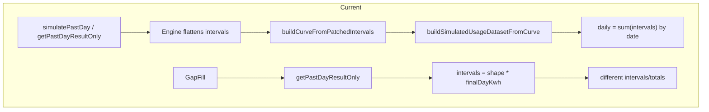

# Shared SimulatedDayResult Refactor Plan

## Important rules

- **Surgical:** Do not rewrite unrelated systems.
- **Contracts:** Do not change any external API contract unless additive and necessary for diagnostics.
- **Preserve:** Keep all existing working functionality unless required for this refactor.
- **Single path:** Do not create multiple competing paths for daily display totals.
- **Shared boundary:** The shared boundary is **only** the simulated-day engine + the simulated-day output artifact. Nothing else is in scope for this refactor. Actual SMT days are **not** part of the shared simulator-core contract.
- **GapFill:** MUST still use real actual holdout days for scoring. Do NOT remove that.
- **Past:** MUST still use actual SMT intervals for non-travel/non-vacant actual days.
- **Simulated only:** Only simulated days should come from the shared simulator core. This plan is ONLY for Past corrected baseline.
- **Goal:** When a day is simulated in GapFill or Past, both use the exact same core module and the exact same simulated day result structure.
- **Artifact authority:** Past Sim and GapFill compare must use the same shared artifact and the same shared fingerprint. Travel/vacant days are the only excluded ownership days. Test days remain included and are evaluation days only.
- **No local rebuilds:** GapFill must not create a compare artifact, create a compare-mask fingerprint, change artifact identity, or reconstruct simulated intervals from `shape * targetDayKwh`.

## Active architecture authority

- There is one shared simulation engine, one shared artifact identity, and one shared fingerprint.
- Travel/vacant days are the only excluded ownership days for the shared artifact fingerprint.
- Test days remain inside the shared artifact population and are only selected by GapFill for scoring against actual usage.
- GapFill is a scoring/reporting workflow only. It may select test days, fetch actual intervals for those days, read the corresponding simulated intervals from the shared artifact, and compute metrics/reports.
- Authoritative shared simulator call chain:
  - `getPastSimulatedDatasetForHouse`
  - `simulatePastUsageDataset`
  - `loadWeatherForPastWindow`
  - `buildPastSimulatedBaselineV1`
  - `buildCurveFromPatchedIntervals`
  - `buildSimulatedUsageDatasetFromCurve`

Modeling-mode compatibility note:
- Canonical simulation-logic reference is `docs/USAGE_SIMULATION_PLAN.md`.
- This refactor plan must stay compatible with that mode split: observed-history reconstruction prioritizes empirical interval+weather behavior; overlay/synthetic modes weight declared home/appliance/occupancy inputs more heavily.
- Do not introduce separate sim math paths by sim option, route, tool, or test.

## LEGACY / NON-AUTHORITATIVE historical drift

- **Core** (`[modules/simulatedUsage/pastDaySimulator.ts](modules/simulatedUsage/pastDaySimulator.ts)`): `simulatePastDay` returns `PastDaySimulationResult` (intervals, profileSelectedDayKwh, finalDayKwh, weather/provenance). `getPastDayResultOnly` returns the same shape without intervals (callers re-apply shape).
- **Past cold**: `[buildPastSimulatedBaselineV1](modules/simulatedUsage/engine.ts)` calls `simulatePastDay` per day, flattens `result.intervals` into one array; `[simulatePastUsageDataset](modules/simulatedUsage/simulatePastUsageDataset.ts)` builds curve from that and `[buildSimulatedUsageDatasetFromCurve](modules/usageSimulator/dataset.ts)` derives daily/monthly/summary from curve.intervals (sum by date, then `buildDisplayMonthlyFromIntervals`).
- **Cache restore** (`[modules/usageSimulator/service.ts](modules/usageSimulator/service.ts)` ~1320–1405): Decodes intervals only; recomputes daily via `buildDailyFromIntervals(decoded)`, monthly via `buildDisplayMonthlyFromIntervalsUtc`, and summary total from `sum(decoded)`. Same derivation as cold in principle, but a separate code path and no per-day provenance.
- **GapFill historical drift** (`[lib/admin/gapfillLab.ts](lib/admin/gapfillLab.ts)` ~1422–1497): Older notes referenced `getPastDayResultOnly` plus local `shape96[slot] * targetDayKwh` interval reconstruction. That behavior is legacy only and is not authoritative for the active architecture.
- **Diagnostics** (`[lib/admin/simulatorDiagnostic.ts](lib/admin/simulatorDiagnostic.ts)`): Compare dataset-level totals and interval digest; no per-day stage comparison (rawDayKwh, weatherAdjusted, finalDayKwh, displayDayKwh, intervalSumKwh).

---

## Target architecture (from spec)

### 1) Canonical simulated day result type

Add or extend a shared type in `modules/simulatedUsage/pastDaySimulatorTypes.ts`. Canonical result shape for simulated days must include:

- `localDate: string`
- `intervals15`
- `intervalSumKwh`
- `displayDayKwh`
- `profileSelectedDayKwh`
- `weatherAdjustedDayKwh`
- `finalDayKwh`
- `fallbackLevel`
- `clampApplied`
- weather/debug/provenance fields already produced by the core

Focus on simulated-day artifacts only. Actual days remain actual usage inputs; simulated days use the canonical SimulatedDayResult. If a unified per-day display wrapper is needed later, that is a thin downstream/view-model concern and NOT part of the shared simulator-core refactor.

### 2) Shared core owns full simulated day output

In `modules/simulatedUsage/pastDaySimulator.ts`:

- Shared core returns the **full** simulated day artifact, not partial day math.
- Single source of truth for: simulated day total selection, weather adjustment, fallback/clamp behavior, 96 interval generation, display day kWh for simulated days.
- Add one shared round helper for day display totals.
- `displayDayKwh` must be derived canonically from simulated intervals and not recomputed differently elsewhere.
- **getPastDayResultOnly:** Do NOT leave it as a partial shortcut that causes drift. Either make it return the same full simulated-day result shape, or turn it into a thin wrapper over the canonical simulator.

### 3) Engine return shape

In `modules/simulatedUsage/engine.ts`:

- Engine returns:
  - the **stitched full-year interval timeline** (flat intervals)
  - **SimulatedDayResult[]** for simulated dates only
- Actual days remain actual usage inputs; the engine does not create a minimal "actual" day artifact. Simulated days use the canonical SimulatedDayResult from the shared core.

### 4) Past dataset build uses day artifacts for display

In `modules/simulatedUsage/simulatePastUsageDataset.ts` and `modules/usageSimulator/dataset.ts`:

- Cold path: daily rows come from day artifacts, not a separate page-specific recomputation.
- Daily table rows use canonical `displayDayKwh`.
- Monthly and summary aggregate from the same day artifact source.
- Flattened intervals still used for charts; displayed daily totals from shared artifact logic.
- Remove duplicate logic that recomputes simulated daily display totals differently.
- Keep actual days actual, simulated days simulated.

### 5) GapFill uses same shared artifact and same simulated-day artifact

In `lib/admin/gapfillLab.ts`:

- **Keep:** holdout logic (real actual intervals, exclude from training, compare simulation vs held-out actual).
- **Change:** For the simulated side, use the exact same shared artifact, shared fingerprint, canonical shared day simulator, and canonical returned intervals/day display values.
- Test days do not create a compare artifact and do not change artifact identity. They only change which days GapFill scores.
- Do NOT rebuild simulated intervals separately from `shape × targetDayKwh` or any other local reconstruction.
- Simulated result for scoring must come directly from the shared simulated-day artifact already produced by the shared engine.
- Actual comparison side remains real held-out SMT intervals.

### 6) Cache format, storage, and restore: one derivation path

After building the corrected Past baseline, save the stitched full-year baseline intervals into existing Past baseline DB storage; this saved artifact is the canonical production artifact. Past page, cache restore, and diagnostics must read/inspect that saved artifact; they must NOT independently restitch at read time.

In `modules/usageSimulator/service.ts`:

- No separate cold-build display logic vs cache-restore display logic.
- One shared helper for daily totals / monthly totals / summary derivation.
- If cache only stores intervals, restore must derive daily/monthly/summary using the **same** aggregation and rounding rules as cold path.
- No second parallel daily display algorithm.
- Overlay logic must not cause cold build vs restore totals to drift for the same underlying simulated data. If monthly overlay exists, preserve intended behavior; keep total derivation internally consistent and documented.

### 7) Diagnostics: day-level parity (additive)

In `lib/admin/simulatorDiagnostic.ts` and optionally `app/admin/simulation-engines/page.tsx`:

- Add **additive** diagnostics to inspect one or more days side by side.
- For a selected day, show (when available) for cold / production / recalc / gapfill-simulated-side: `source`, `localDate`, `intervalSumKwh`, `displayDayKwh`, `profileSelectedDayKwh`, `weatherAdjustedDayKwh`, `finalDayKwh`, `fallbackLevel`, `clampApplied`, interval digest.
- Diagnosis only. Additive and safe. Admin simulation engine page continues to work; any new UI simple and optional.

### 8) Remove duplicate post-core display logic

Search touched files for places that recompute simulated day totals after the shared core. One truth: shared simulator decides simulated day output; Past uses that output for simulated days; GapFill uses that output for simulated holdout days; cache/restore uses one shared derivation path, not a second custom one.

### 9) Preserve actual-vs-simulated split

Do NOT break:

- **Past:** actual day → actual SMT intervals; travel/vacant simulated day → shared simulator.
- **GapFill:** actual held-out day → actual SMT intervals for scoring truth; simulated comparison day → shared simulator.

---

## 1. Define canonical SimulatedDayResult type

**Where:** New shared types file or extend `[modules/simulatedUsage/pastDaySimulatorTypes.ts](modules/simulatedUsage/pastDaySimulatorTypes.ts)`.

**Shape (minimum):**

- **Identifiers:** `localDate` (YYYY-MM-DD).
- **Classification:** `travelVacantClassification`: `"simulated"` | `"actual"` (or dayIsExcluded/dayIsLeadingMissing booleans).
- **Profile/reference:** `selectedProfileDayKwh` (raw from profile), `fallbackLevel`, `clampApplied`.
- **Weather:** `weatherInputsUsed` (or ref to weather features), `weatherAdjustedDayKwh` (preBlendAdjustedDayKwh), `weatherSeverityMultiplier`, `weatherModeUsed`, `dayClassification`, aux/pool adders.
- **Totals:** `rawDayKwh` (= selectedProfileDayKwh), `weatherAdjustedDayKwh`, `finalDayKwh` (pre-display blend/clamp), `displayDayKwh` (canonical display value = round2(intervalSumKwh)), `intervalSumKwh` (sum of intervals).
- **Intervals:** `intervals15` (96 points).
- **Provenance/debug:** existing fields (fallbackLevel, clampApplied, auxHeatGate_*, preBlendAdjustedDayKwh, blendedBackTowardProfile, shape96Used, etc.) so diagnostics can show stage parity.

**Invariant:** `displayDayKwh === round2(intervalSumKwh)` so any consumer that derives daily from intervals gets the same number. Core will set `displayDayKwh = round2(intervalSumKwh)` after building intervals.

**Naming:** Either rename `PastDaySimulationResult` to `SimulatedDayResult` and extend it, or introduce `SimulatedDayResult` and have `PastDaySimulationResult` as an alias during migration.

---

## 2. Refactor shared core to return SimulatedDayResult

**Files:** `[modules/simulatedUsage/pastDaySimulatorTypes.ts](modules/simulatedUsage/pastDaySimulatorTypes.ts)`, `[modules/simulatedUsage/pastDaySimulator.ts](modules/simulatedUsage/pastDaySimulator.ts)`.

- **Types:** Add `SimulatedDayResult` (or extend `PastDaySimulationResult`) with: `rawDayKwh`, `weatherAdjustedDayKwh`, `finalDayKwh`, `displayDayKwh`, `intervalSumKwh`, `intervals15`, plus travel/vacant and weather/provenance as above. Keep existing fields for backward compatibility during migration.
- **simulatePastDay:** After building `intervals`, set `intervalSumKwh = sum(intervals)`, `displayDayKwh = round2(intervalSumKwh)`. Populate `rawDayKwh` (= profileSelectedDayKwh), `weatherAdjustedDayKwh` (= preBlendAdjustedDayKwh). Return type: `SimulatedDayResult`. Use a single `round2` helper (e.g. `x => Math.round(x * 100) / 100`) in one place and reuse for displayDayKwh and anywhere else that rounds day totals.
- **getPastDayResultOnly:** Either (a) deprecate and have callers use `simulatePastDay` (then take `.displayDayKwh` / `.intervals15`), or (b) keep as thin wrapper that builds grid timestamps, calls `simulatePastDay`, returns same `SimulatedDayResult` (so GapFill can switch to full result without changing API surface). Prefer (b) for surgical change: `getPastDayResultOnly` becomes "simulatePastDay with default grid for that date" and returns full `SimulatedDayResult` including intervals.
- **Docstring:** State that this module is the single source of truth for simulated day totals and intervals for Past and GapFill; all display day values and interval arrays must come from this result.

---

## 3. Engine: return stitched timeline + SimulatedDayResult[] for simulated dates only

**File:** `[modules/simulatedUsage/engine.ts](modules/simulatedUsage/engine.ts)`.

- **buildPastSimulatedBaselineV1** returns: (1) the **stitched full-year interval timeline** (flat array of intervals: actual + simulated), and (2) **SimulatedDayResult[]** for simulated dates only. No actual-day artifact.
- Actual days remain actual usage inputs; only simulated days get a SimulatedDayResult. If a unified per-day display wrapper is needed later, that is a thin downstream/view-model concern, not part of this refactor.
- **Simulated days:** For each day where `simulatePastDay` is called, push the full `SimulatedDayResult` into `dayResults`. Flatten `result.intervals` into the stitched timeline.
- **Callers:** Update `simulatePastUsageDataset` to accept `dayResults` (simulated only) from the engine and use them when building the dataset for simulated-day display totals.

---

## 4. Past pipeline: build daily/monthly/summary from SimulatedDayResult when available

**Files:** `[modules/simulatedUsage/simulatePastUsageDataset.ts](modules/simulatedUsage/simulatePastUsageDataset.ts)`, `[modules/usageSimulator/dataset.ts](modules/usageSimulator/dataset.ts)`.

- **simulatePastUsageDataset:** Call `buildPastSimulatedBaselineV1` and get `{ intervals, dayResults }`. Build curve from `intervals` (unchanged). Then either:
  - **Option A:** Add `buildSimulatedUsageDatasetFromDayResults(dayResults, meta, options)` that builds `daily = dayResults.map(r => ({ date: r.localDate, kwh: r.displayDayKwh }))`, monthly from aggregating daily (same timezone/useUtcMonth rules as today), summary from daily/monthly, and `series.intervals15` from flattening `dayResults[].intervals15`. Use this for cold path when `dayResults` is present.
  - **Option B:** Keep `buildSimulatedUsageDatasetFromCurve` but have it accept an optional `dayResults`; when provided, build `daily` from `dayResults[].displayDayKwh` instead of summing curve.intervals by date. Intervals still come from curve (or from dayResults flat) so series.intervals15 is unchanged.
- **Single rounding:** Ensure the same `round2` used in the core for `displayDayKwh` is used when building monthly/summary from daily (e.g. in `buildDisplayMonthlyFromIntervals` or in the new day-results-based builder) so totals are consistent.
- **Comment:** In `simulatePastUsageDataset` and in the dataset builder, add a short comment that daily display values come from the shared core `SimulatedDayResult.displayDayKwh` and must not be recomputed elsewhere for cold path.

---

## 5. GapFill: use full SimulatedDayResult (intervals + display)

**File:** `[lib/admin/gapfillLab.ts](lib/admin/gapfillLab.ts)` (test-window compare path or equivalent).

- **LEGACY / NON-AUTHORITATIVE:** Older GapFill notes referenced `getPastDayResultOnly` (no intervals) followed by local `shape96[slot] * targetDayKwh` interval reconstruction, which could drift from Past. That is not acceptable in the active architecture.
- **Change:** For each test day, call `simulatePastDay` with the same grid timestamps and context (or keep using `getPastDayResultOnly` if it is updated to return full `SimulatedDayResult` including intervals). Use `dayResult.intervals15` (or `dayResult.intervals`) for scoring and `dayResult.displayDayKwh` for any displayed day total. Do not recompute intervals from shape × finalDayKwh.
- **Result:** GapFill and Past show the same intervals and same display day total for the same house/scenario/day.

---

## 6. Cache format, storage, and restore

**Files:** `[modules/usageSimulator/pastCache.ts](modules/usageSimulator/pastCache.ts)`, `[modules/usageSimulator/service.ts](modules/usageSimulator/service.ts)`.

- **After building the corrected Past baseline:** Save the stitched full-year baseline intervals into the existing Past baseline DB storage. This saved Past baseline artifact is the **canonical production artifact** for the Past page.
- **Past page, cache restore, and diagnostics** must read/inspect **that saved artifact**. They must NOT independently restitch simulated days differently at read time.
- **Option A (minimal change):** Keep storing only encoded intervals (and existing datasetJson skeleton). On restore, build daily with the **same** helper used for "daily from intervals": e.g. `buildDailyFromIntervals(decoded)` using the same `round2` as the core's `displayDayKwh`. Document that cold (daily from dayResults.displayDayKwh) and restore (daily from buildDailyFromIntervals) are identical because core sets `displayDayKwh = round2(intervalSumKwh)` and buildDailyFromIntervals uses the same rounding. No schema change.
- **Option B (full artifact):** Extend cache to store a compact per-day array (e.g. `dayResults: { localDate, displayDayKwh, intervalSumKwh }[]` or full SimulatedDayResult minus large fields). Restore builds daily from that array instead of from decoded intervals. Requires migration and larger cache payload; do only if parity issues remain after Option A.

**Recommendation:** Implement Option A first; add a single shared `round2DayKwh(sum)` (or use existing round2 in dataset) and use it in core and in `buildDailyFromIntervals`. Ensure cache restore path uses only that and the same monthly builder as cold. If diagnostics still show cold vs cache differences, consider Option B in a follow-up.

- **Remove duplicate logic:** In `[service.ts](modules/usageSimulator/service.ts)` cache-restore block (~1330–1385), avoid recomputing monthly then overwriting with overlay in a way that changes totals. Keep "single source of truth" as: summary total = round2(sum(decoded intervals)); daily = buildDailyFromIntervals(decoded); monthly from same aggregation rules as cold; then apply actual overlay only to monthly rows (non-travel months = actual), and recompute summary total from overlay-adjusted monthly so it stays consistent. Document that display values for simulated days ultimately derive from the same rounding as the core.

---

## 7. Diagnostics: per-day stage parity

**Files:** `[lib/admin/simulatorDiagnostic.ts](lib/admin/simulatorDiagnostic.ts)`, `[app/admin/simulation-engines/page.tsx](app/admin/simulation-engines/page.tsx)` (if UI is extended).

- **Admin tools must inspect the SAME saved Past baseline artifact that production pages read.** They must NOT compute an alternate Past baseline.
- **Diagnostics should distinguish:** (1) raw actual usage source, (2) simulated replacement day source, (3) saved stitched Past baseline artifact. Additive only; scope stays Past corrected baseline.
- **Engine:** When diagnostic runs with a "selected day" or sample days, ensure `dayResults` (or existing `dayDiagnostics`) include the new fields: `rawDayKwh`, `weatherAdjustedDayKwh`, `finalDayKwh`, `displayDayKwh`, `intervalSumKwh`. Extend `PastSimulatedDayDiagnostic` (or use SimulatedDayResult) so diagnostics can compare these across cold/cache/recalc/GapFill.
- **runSimulatorDiagnostic:** If engine returns `dayResults`, pass a subset (e.g. first N or a chosen date) into the diagnostic payload. Add an optional "day-level parity" section: for a selected day, compare cold vs production (cache) vs recalc: same displayDayKwh, intervalSumKwh, and optionally rawDayKwh, weatherAdjustedDayKwh, finalDayKwh. Reuse interval digest for that day's intervals if needed.
- **Admin UI:** Optional: add a "Select day" and show side-by-side stage parity (raw, weatherAdjusted, final, display, intervalSum) for that day across cold/cache/recalc. Can be a follow-up if time-boxed.

---

## 8. Remove duplicate post-core display logic

**Search and consolidate:**

- **dataset.ts:** `buildSimulatedUsageDatasetFromCurve` and `buildDailyFromIntervals`: ensure daily row kwh is produced by one code path when building from curve (either from dayResults.displayDayKwh when available, or from round2(sum(intervals by date)) using the same round2 as the core). Remove any other place that recomputes "display day total" or "daily row kwh" with different rounding or formula.
- **service.ts:** Cold path in `getPastSimulatedDatasetForHouse` and overlay block: already sets totalKwh from sum(intervals15). Ensure overlay only replaces monthly cells and then recomputes summary total from that monthly (or from sum intervals) with the same round2; no separate "overlaySum" that ignores intervals.
- **service.ts cache restore:** Same as above: one place that sets daily/monthly/summary from decoded intervals (and overlay); remove redundant totals logic.
- **GapFill:** Remove any loop that builds intervals from `shape96[slot] * targetDayKwh`; use shared-engine intervals from `SimulatedDayResult`.
- **Comments:** In each consolidated path, add a one-line comment: "Daily display values from shared core SimulatedDayResult (single source of truth for Past and GapFill)."

---

## Past corrected baseline storage and retrieval rule

Past corrected baseline must be treated as its own saved full-year artifact in the database, using the existing Past baseline usage storage/column that is already intended for that purpose.

### Rule

- Real historical usage data remains the raw source of truth.
- The Past corrected baseline is a separate stitched artifact:
  - non-travel / non-vacant days = real historical intervals
  - travel / vacant days = simulated intervals generated by the shared core sim module

### Storage

The stitched full-year interval dataset must be saved into the existing Past baseline DB storage already designated for Past baseline usage.

The system must NOT:

- overwrite raw usage
- store only simulated days
- rebuild the Past baseline differently at display time

### Retrieval

The Past page must read the saved Past baseline artifact directly.

This ensures:

- display consistency
- cache consistency
- diagnostic repeatability
- a single canonical corrected Past baseline curve

### Composition

Past corrected baseline =

real usage intervals  

- simulated travel/vacant replacement days  
= full corrected Past baseline timeline

### Scope boundary

This rule applies **ONLY** to Past corrected baseline. Do not introduce future baseline, final usage, upgrade simulation, solar/battery, or broader scenario-engine changes.

Do NOT include:

- future baseline
- final usage
- upgrade simulation
- solar/battery modeling
- scenario engines

---

## Admin tools support for Past corrected baseline plan

The admin simulation tools must support debugging and verifying the Past corrected baseline pipeline.

These tools must be accessible from:

**/admin/simulation-engines**

### Required admin capabilities

**1. Past baseline rebuild tool**

Admin must be able to:

- trigger a rebuild of the Past corrected baseline
- recompute simulated travel/vacant days
- restitch the Past corrected baseline artifact
- resave the artifact in the Past baseline DB storage

This rebuild must use the SAME shared core sim module used by GapFill.

**2. Baseline source inspector**

Admin must be able to view, for any date:

- source = actual_usage
- source = simulated_vacant_day

This confirms the stitching logic is working correctly.

**3. Interval comparison viewer**

Admin tool must allow viewing:

- raw usage intervals
- simulated intervals (for travel days)
- final stitched Past baseline intervals

This makes debugging mismatches possible.

**4. GapFill validation link**

GapFill testing must remain connected to the SAME core day simulation module used for Past vacant-day replacement.

Improving realism in GapFill must directly improve Past baseline travel-day simulation.

**5. Weather source diagnostic**

Admin must show for each simulated day:

- weather source
- fallback reason if weather = stub
- location used
- weather timestamp range

This allows identifying why weather data is not loading.

### Important constraint

Admin tools must inspect the **same saved Past baseline artifact** that production pages read. Admin must NOT compute an alternate Past baseline that differs from the saved Past baseline artifact.

---

## 9. Contract and caller updates

- **API routes:** No change to external REST contracts (e.g. diagnostic or simulation-engines response shape) unless we add optional `dayResults` or `dayLevelParity`; keep those additive.
- **Internal callers:** Update in one pass:
  - `buildPastSimulatedBaselineV1` return shape (add dayResults).
  - `simulatePastUsageDataset` (accept dayResults, pass to dataset builder).
  - `buildSimulatedUsageDatasetFromCurve` or new `buildSimulatedUsageDatasetFromDayResults` (and all callers of the former).
  - GapFill: switch to full SimulatedDayResult and core intervals.
  - Diagnostic: consume dayResults / extended day diagnostics for day-level parity.

---

## 10. Success criteria

- For the same house/scenario/date, if that date is **simulated**, Past and GapFill use the **same** shared simulator, **same** shared artifact, **same** shared fingerprint, and **same** simulated-day artifact.
- GapFill still scores against real held-out actual data.
- Past still uses real SMT data for real non-travel/non-vacant days.
- Daily displayed kWh for simulated days is no longer computed differently in different parts of the app.
- Cold build, cache restore, and recalc use one consistent derivation path and no longer drift because of duplicate display logic.
- Diagnostics can show day-level parity for a selected day.
- Changes stay as small and understandable as possible.

---

## Implementation order

1. Add canonical shared simulated-day type.
2. Refactor shared simulator to return full simulated-day artifact.
3. Update engine to return stitched timeline + SimulatedDayResult[] for simulated dates only.
4. Update Past dataset builder to consume day artifacts for displayed daily totals.
5. Update GapFill to consume the shared simulated-day artifact directly.
6. Unify cache-restore derivation path.
7. Add additive day-level diagnostics.
8. Remove leftover duplicate post-core simulated-day display logic.

---

## When done (deliverable)

After implementation, provide:

- **Concise summary** of exactly what changed.
- **Contract changes** (if any; prefer additive only).
- **Remaining known drift points** (if any).
- **Exact files changed** (list).
- **Exact manual checks** to run on `/admin/simulation-engines`.

---

## Plan adjustments made

- **Shared boundary narrowed:** Made explicit that the shared boundary is ONLY the shared simulator output path and shared simulated-day output artifact. Added that actual SMT days are NOT part of the shared simulator-core contract. Reinforced that this plan is ONLY for Past corrected baseline.
- **Actual day result removed:** Replaced any requirement for the engine to create a minimal "actual" day artifact. Actual days remain actual usage inputs; simulated days use canonical SimulatedDayResult. Any unified per-day display wrapper is a thin downstream/view-model concern, not part of this refactor. Plan focused on simulated-day artifacts only.
- **Engine return shape tightened:** Engine now returns (1) the stitched full-year interval timeline and (2) SimulatedDayResult[] for simulated dates only. Removed wording that downstream must get one unified artifact list for every day in the full window.
- **Past baseline storage/retrieval in implementation:** In the cache/storage section, added explicitly: after building the corrected Past baseline, save the stitched full-year baseline intervals into existing Past baseline DB storage; this saved artifact is the canonical production artifact; Past page, cache restore, and diagnostics must read/inspect that saved artifact; they must NOT independently restitch at read time.
- **Diagnostics/admin tightened:** Admin tools must inspect the SAME saved Past baseline artifact that production pages read. Diagnostics must distinguish raw actual usage source, simulated replacement day source, and saved stitched Past baseline artifact. Additive only; scope remains Past corrected baseline.
- **Scope boundary reinforced:** In Scope boundary and Important rules, reinforced that this plan is ONLY for Past corrected baseline. No future baseline, final usage, upgrade simulation, solar/battery, or broader scenario-engine changes.
- **Rest preserved:** GapFill still uses real holdout actual data for scoring; Past still uses actual SMT for non-travel/non-vacant days; GapFill and Past use the same shared artifact, shared fingerprint, and shared simulated-day artifact for simulated days; one shared rounding / one derivation path for simulated-day display totals.
