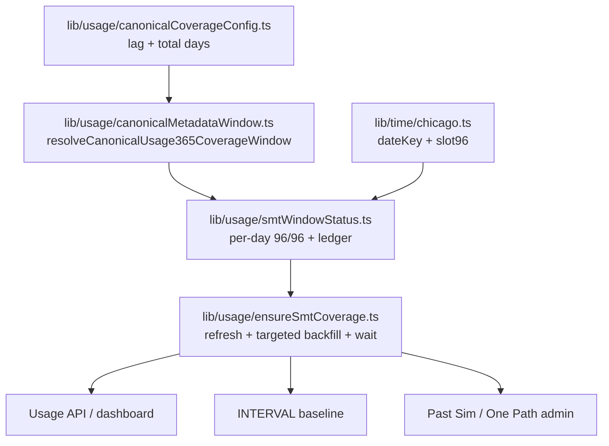

# SMT unification plan (implementation detail)

**Master plan entry:** `docs/PROJECT_PLAN.md` → **PC-2026-05 — SMT interval coverage unification**

**Status:** **Complete** (Phases 1–8 shipped). **Record:** `docs/SMT_UNIFICATION_COMPLETE.md`. **Ongoing:** `.cursor/rules/smt-unification-lock.mdc` (always apply) — any SMT-related change must preserve single owners below.

**Last updated:** 2026-05-20

This document is the **single implementation spec** for unifying Smart Meter Texas (SMT) interval coverage: one window, one day-status read, one heal path, strict **96/96** Chicago slots for SMT, per-session heal throttle. **Green Button is out of scope** for behavior changes in this effort.

---

## Problem statement

SMT coverage today is inconsistent because:

- Multiple entry points pull/backfill/wait (`userUsageRefresh`, `ensureSmtTailCoverage`, `/api/user/smt/orchestrate`, One Path admin post-sim healing with `requestTargetedSmtIntervalBackfillForHouse`).
- Multiple “ready” definitions (`SMT_READY_COMPLETENESS` 99% span vs ledger 96 slots vs Past Sim `MIN_TRUSTED_ACTUAL_INTERVALS_PER_DAY = 90`).
- Duplicate Chicago timestamp helpers (`chicagoDateKey`, slot-96) in routes, `actualDatasetForHouse`, `smtTailCoverage`, adapters.
- Lag `2` duplicated in policy files and hardcoded in admin tools; `rollingAutoAnchorEndDateChicago` uses ms subtraction instead of calendar lag.
- `history_ready` could skip wide backfill while per-day gaps remained; heal now targets all incomplete canonical-window days and refresh retries wide backfill after 30m when gaps remain.

**Product rules (locked):**

| Rule | Detail |
|------|--------|
| Window lag | **2 calendar days** in Chicago; changeable in **one config file** only (`lib/usage/canonicalCoverageConfig.ts`). |
| SMT completeness | **96/96** distinct Chicago 15-minute slots per calendar day. |
| Green Button | **Do not edit** `modules/realUsageAdapter/greenButton.ts`; GB keeps looser/trusted-shifted rules. |
| Usage + baseline (INTERVAL/SMT) | Show whatever intervals exist (partial OK). |
| Past Sim (INTERVAL/SMT) | Days with &lt; 96 slots **not** in trusted pool; simulate with “intervals not fully available” labeling. |
| Heal | All surfaces **trigger** the same usage-owned heal; **no** One Path–only SMT pull/backfill. |
| Heal throttle | **Once per session** per house (not every wizard step); Past Sim **run** may use `force` or run-scoped key. |
| One Path isolation | `modules/onePathSim/**` must **not** import `modules/usageSimulator/**`; shared code in `lib/**` only. |
| Canonical window lock | Non-baseline coverage meta still from shared window helper (after Phase 7: `lib/usage/canonicalMetadataWindow.ts`). |

---

## Target architecture (single owners)



| Concern | Owner module | Consumers |
|---------|----------------|-----------|
| Lag 2→3 knob | `lib/usage/canonicalCoverageConfig.ts` | Policy files, `chicago.ts`, metadata window |
| 365-day window | `lib/usage/canonicalMetadataWindow.ts` | Sim metadata, tail scope, status enumeration |
| Chicago date/slot | `lib/time/chicago.ts` | SMT ingest display, coverage, engines (SMT paths) |
| Day status read | `lib/usage/smtWindowStatus.ts` | Routes, tail helpers, orchestrate, UI messages |
| Heal orchestration | `lib/usage/ensureSmtCoverage.ts` | Usage route, refresh, orchestrate, upstream truths, One Path admin |
| Targeted day backfill impl | `lib/usage/smtIncompleteMeterBackfill.ts` | **Only** called from `ensureSmtCoverage` |
| Ledger | `lib/usage/smtDayCoverageLedger.ts` | Reconcile after ingest/heal |
| Persisted intervals | DB + `actualDatasetForHouse` / `resolveIntervalsLayer` | Read after heal |

**Detect vs act:**

- **Detect:** one status map (`isComplete === slotCount === 96`, ledger `COMPLETE` / `INCOMPLETE_METER` / `PENDING_SMT`).
- **Act (display):** usage/baseline plot partials.
- **Act (sim):** Past Sim excludes non-complete days from trusted pool.

---

## Current → target file map (implementation checklist)

### Phase 1 — Lag knob

| Action | Files |
|--------|--------|
| **Create** | `lib/usage/canonicalCoverageConfig.ts` |
| **Wire** | `modules/usageSimulator/simulationVariablePolicy.ts`, `modules/onePathSim/simulationVariablePolicy.ts` |
| **Fix** | `lib/time/chicago.ts` (`rollingAutoAnchorEndDateChicago`, default lag), `lib/admin/gapfillLabPrime.ts` |
| **Tests** | `tests/time/canonicalUsageWindowChicago.test.ts` |

### Phase 2 — SMT timestamps

| Action | Files |
|--------|--------|
| **Consolidate** | Move `chicagoSlot96FromTs` → `lib/time/chicago.ts` |
| **Import** | `lib/usage/smtTailCoverage.ts`, `lib/usage/actualDatasetForHouse.ts` (SMT only), `app/api/user/usage/status/route.ts`, `app/api/user/smt/orchestrate/route.ts`, `modules/realUsageAdapter/smt.ts` |
| **Do not edit** | `modules/realUsageAdapter/greenButton.ts` |
| **Tests** | `tests/time/chicagoSlot96.test.ts`, `tests/usage/smtTailCoverage.test.ts` |

### Phase 3 — Window day status

| Action | Files |
|--------|--------|
| **Create** | `lib/usage/smtWindowStatus.ts` (`SMT_REQUIRED_SLOTS_PER_DAY = 96`) |
| **Refactor** | `lib/usage/smtTailCoverage.ts` |
| **Replace 99% ready** | `app/api/user/smt/orchestrate/route.ts`, `app/api/user/usage/status/route.ts` |
| **Tests** | `tests/usage/smtWindowStatus.test.ts` |

### Phase 4 — Heal owner + session throttle

| Action | Files |
|--------|--------|
| **Create** | `lib/usage/ensureSmtCoverage.ts` |
| **Restrict callers** | `requestTargetedSmtIntervalBackfillForHouse` only from ensure |
| **Remove** | Direct healing in `app/api/admin/tools/one-path-sim/route.ts` (`maybeRunOnePathSmtPostSimHealing`, etc.) |
| **Tests** | `tests/usage/ensureSmtCoverage.test.ts`, update `tests/usage/admin.onePathSim.route.test.ts` |

### Phase 5 — Wire consumers

| Action | Files |
|--------|--------|
| **Wire** | `lib/usage/userUsageRefresh.ts`, `app/api/user/usage/route.ts`, `app/api/user/usage/refresh/route.ts`, `app/api/user/smt/orchestrate/route.ts`, `modules/onePathSim/upstreamUsageTruth.ts`, `modules/usageSimulator/upstreamUsageTruth.ts`, `app/api/admin/tools/one-path-sim/route.ts` |
| **Tests** | `tests/onePathSim/upstreamUsageTruth.tail.test.ts`, isolation source tests |

### Phase 6 — Past Sim strict 96

| Action | Files |
|--------|--------|
| **Change** | `modules/simulatedUsage/engine.ts`, `modules/onePathSim/simulatedUsage/engine.ts` — `MIN_TRUSTED_ACTUAL_INTERVALS_PER_DAY = 96`, slot counting via `chicagoSlot96FromTs` |
| **Do not edit** | Green Button branches / `greenButton.ts` |
| **Tests** | One Path + simulatedUsage engine tests |

### Phase 7 — Metadata dedupe

| Action | Files |
|--------|--------|
| **Create** | `lib/usage/canonicalMetadataWindow.ts` |
| **Thin** | `modules/usageSimulator/metadataWindow.ts`, `modules/onePathSim/usageSimulator/metadataWindow.ts` |

### Phase 8 — Closure

| Action | Files |
|--------|--------|
| **Add** | `docs/SMT_UNIFICATION_COMPLETE.md` (when all greps green) |
| **Verify** | Full test suite + optional `scripts/audit-smt-day-coverage.ts` |

---

## Files that must NOT gain new SMT logic

- `modules/realUsageAdapter/greenButton.ts`
- `app/api/admin/tools/one-path-sim/route.ts` — after Phase 4/5, no direct `requestSmtBackfill` / targeted backfill / long waits
- New duplicate `chicagoDateKey` in routes

## Known duplicate / drift today (grep audit targets)

```text
canonicalCoverageLagDays: 2     → modules/*/simulationVariablePolicy.ts, gapfillLabPrime
reliableLagDays: 2               → lib/admin/gapfillLabPrime.ts
SMT_READY_COMPLETENESS           → orchestrate, usage/status
MIN_TRUSTED_ACTUAL = 90          → both Past Sim engines
requestTargetedSmtIntervalBackfill → one-path-sim route (remove)
ensureSmtTailCoverageForUserHouse  → usage route, onePath upstream (replace with ensure)
```

---

## Session heal contract

- **Key:** `userId` + `houseId` + `sessionKey` (cookie, header `x-usage-session`, or client-generated visit id).
- **Once per session:** first usage load or dashboard visit calls `ensureSmtCoverage(profile: 'user_session')`; subsequent loads skip heal unless `force: true` (manual refresh).
- **Past Sim run:** `sessionKey` = run id or `force: true` at admin run start (`profile: 'sim_run' | 'admin_sim'`).
- **Return payload** should include `healed`, `skippedReason`, `dayStatus` summary for diagnostics.

---

## Verification script (optional per phase)

```bash
npx tsx scripts/audit-smt-day-coverage.ts <houseId> <esiid> <startDate> <endDate>
```

Use for dates that phase may affect (e.g. 2026-05-17 after slot consolidation). **Not** a gating Phase 0 — only when the phase touches counting or ingest display.

---

## Related docs

- Copy-paste prompts: `docs/SMT_UNIFICATION_PHASE_PROMPTS.md`
- New chat bootstrap: `docs/SMT_UNIFICATION_AGENT_BOOTSTRAP.md`
- Usage layers: `docs/USAGE_LAYER_MAP.md`
- One Path (update after Phase 5): `docs/ONE_PATH_SIM_ARCHITECTURE.md`
- Cursor rule: `.cursor/rules/smt-unification-lock.mdc`
- Shared sim window: `.cursor/rules/shared-sim-window-lock.mdc`

---

## Post-completion (Phase 8)

Create `docs/SMT_UNIFICATION_COMPLETE.md` listing final single owners and date completed. Update `docs/CHAT_BOOTSTRAP.txt` SMT section to “shipped” state.
