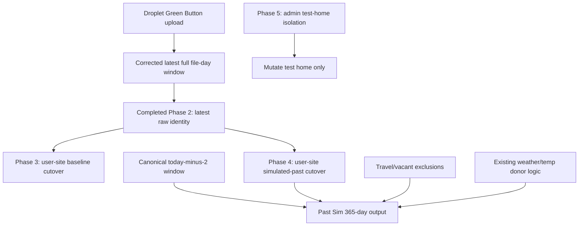

# Green Button One Path Remaining Plan

## Completed Work

Phase 1 and Phase 2 are complete and should not be reworked as part of this plan.

- Phase 1 completed the deployed Droplet Green Button ingest trim path: post-normalization latest-full-Chicago-day windowing, up to 365 local days, without changing parsing or normalization.
- Phase 2 completed user Green Button latest raw identity alignment: bucket generation, fingerprints, plan estimate inputs, dashboard plans, plan detail, compare, and plan pipeline now align to the selected latest usable raw upload.

## Remaining Scope Boundary

- Do not change Droplet parsing, normalization, or trim behavior.
- Do not rework Phase 2 latest raw identity unless a remaining phase exposes a direct integration bug.
- Do not change SMT behavior except to keep parity tests passing.
- Do not change non-baseline shared-window ownership: Past Sim coverage must continue to use `resolveCanonicalUsage365CoverageWindow()`.
- Do not mutate real user homes from admin One Path execution; admin mode should mutate only the test home.
- Do not create Green Button-specific simulation math. Green Button should route through the existing shared SMT/One Path/Past Sim logic where possible.
- Do not treat shifted Green Button actuals as one-off date patches. Trusted shifted source days are generalized actual-usage truth, using the shared 90-interval threshold bounded by `expectedIntervalsForDateISO()` for DST.

## Current Remaining Problem

Green Button user usage and plan estimate identity are now aligned, but One Path still needs to consume that corrected upstream Green Button source safely:

- Baseline should display the exact uploaded-file window for Green Button, up to 365 full file days, ending on the latest full interval day in the file.
- Past Sim should use Green Button actuals as an actual-day pool while preserving the normal shared today-minus-2 365-day output window.
- Shifted prior-year Green Button source days that meet trusted coverage must remain actual-backed on their target dates, win over trailing/current-year partial intervals, preserve `sourceDateByTargetDate`, disclose source-day weather use, and must not become `SIMULATED_INCOMPLETE_METER`.
- Admin One Path Green Button uploads must be isolated to the test home and must not mutate the selected source home.
- Final verification must prove Green Button, SMT, shared-window, and admin isolation behavior still hold.

## User-Site Cutover Intent

- Phase 3 is the user-site baseline cutover for Green Button.
- Phase 4 is the user-site simulated-past cutover for Green Button.
- Admin and read-only One Path views are verification surfaces, not the end target by themselves.
- The user site should consume the same One Path/shared sim read models and output contracts rather than maintaining separate Green Button-only display paths.

## Completed Pre-Code Audit Summary

- Phase 3 audit found that Green Button baseline already has a One Path passthrough chain, but user-site read/display surfaces still need to be cut over so they do not independently derive Green Button baseline windows.
- Phase 4 audit found that the live Past Sim production chain is primarily under `modules/simulatedUsage` and `modules/usageSimulator`, while `modules/onePathSim/simulatedUsage` is a parallel harness/fork that must only be touched if parity requires it.
- Phase 5 audit found that the One Path admin upload ticket signs the lab/test home, but Droplet upload completion does not currently run the same post-ingest bucket/plan-prep hooks as the user upload route.
- The audits are now part of this plan. Coding should begin with Phase 3 implementation, not with more broad exploration.

## Phase 3: Green Button Baseline Ownership And Passthrough

### Goal

Cut the user-facing Green Button baseline read/display path onto the One Path baseline passthrough path for `GREEN_BUTTON`, so user-site baseline displays the corrected uploaded-file window exactly.

### Exact Scope

- Baseline mode only.
- This phase is not only an internal One Path baseline fix; it is the user-site Green Button baseline cutover.
- User-facing Green Button baseline must use the same One Path baseline passthrough/read model as the One Path baseline path.
- Use exact file-backed Green Button source window for baseline.
- Prevent canonical today-minus-2 clipping for Green Button baseline.
- Keep `dataset.summary.start/end`, `dataset.meta.coverageStart/coverageEnd`, daily rows, and charts consistent from the same Green Button source-window metadata.
- User-site displayed charts must use that same source-window start/end.
- Baseline should display up to 365 full file days ending on the latest full interval day in the uploaded file.
- Do not synthesize baseline days.
- Keep SMT baseline behavior unchanged.

### Explicitly Out Of Scope

- Non-baseline Past Sim shared-window ownership.
- Simulation math changes.
- Droplet ingest changes.
- User usage identity changes beyond direct integration with completed Phase 2.
- A separate legacy user-site Green Button route-local baseline window derivation.

### Files Likely Involved

- `modules/onePathSim/onePathSim.ts`
- `modules/onePathSim/upstreamUsageTruth.ts`
- `modules/onePathSim/baselineReadOnlyView.ts`
- `modules/onePathSim/runReadOnlyView.ts`
- `app/api/user/usage/route.ts`
- `app/api/dashboard/plans/route.ts`
- `lib/usage/userUsageDashboardViewModel.ts`
- `components/admin/OnePathBaselineReadOnlyView.tsx` for display verification only.
- User-facing Green Button baseline read/display entry points identified by the Phase 3 audit.
- Focused tests under `tests/onePathSim` and/or `tests/usage`.

### Preconditions / Audit Requirements

- Phase 1 complete.
- Phase 2 complete.
- Phase 3 baseline data-shape audit is complete.
- Audit result: baseline core display is not hard-dependent on full-window `series.intervals15`; daily rows plus monthly derived from daily are sufficient for core charts/totals, while full `intervals15` improves interval-native readouts such as 15-minute curves.
- Audit result: Green Button baseline adapter path is `adaptGreenButtonRawInput` -> `buildCanonicalEngineInput` -> `buildBaselinePassthroughArtifact` -> `buildIntervalBaselinePassthroughDataset`, with optional `enrichGreenButtonBaselinePassthroughDataset`.
- Audit result: `buildCanonicalEngineInput` already anchors Green Button baseline coverage to `actualDataset.summary.start/end` when `inputType === "GREEN_BUTTON"` and `scenarioId == null`.
- Audit result: non-baseline Green Button does not receive baseline source-window ownership because the Green Button anchor condition is baseline-only; non-baseline remains shared-window owned.
- Audit result: user-site routes still include separate window/read behavior that must be cut over or proven aligned:
  - `app/api/user/usage/route.ts` uses `resolveIntervalsLayer` / `getActualUsageDatasetForHouse` and source selection defaults where SMT can win if both SMT and Green Button exist.
  - `lib/usage/userUsageDashboardViewModel.ts` can fall back to `resolveCanonicalUsage365CoverageWindow()` if `meta.coverageStart/coverageEnd` are missing.
  - `app/api/dashboard/plans/route.ts` has route-local Green Button latest timestamp minus 365-day math for plan usage summary.

### Implementation Notes

- Apply source-window ownership only to Green Button baseline.
- Cut user-facing Green Button baseline onto the One Path baseline passthrough/read model.
- Use uploaded-file window metadata from the selected raw Green Button source.
- Keep baseline metadata and rendered rows driven from one source-window contract.
- Remove or bypass separate user-site route-local baseline window derivation for Green Button.
- Do not add compatibility shims around canonical shared-window logic; isolate baseline behavior instead.
- Preserve existing SMT baseline path.
- Preserve Green Button baseline `seedIfMissing: false` behavior; baseline should require persisted upstream truth instead of creating source data.
- Treat admin/read-only baseline views as verification surfaces, not the user-site target.

### Acceptance Criteria

- Green Button baseline displays up to 365 days from the uploaded file window.
- When the uploaded file contains 365 full days, displayed daily count is 365.
- Baseline last displayed day equals the latest full interval day in the uploaded/persisted Green Button window.
- Baseline metadata and displayed rows use the same start/end.
- SMT baseline behavior remains unchanged.
- Non-baseline Green Button scenarios still use shared canonical window ownership.
- User-facing Green Button baseline uses the same One Path baseline passthrough/read model as the One Path baseline path, not a separate legacy route-local window derivation.

### Verification / Tests

- Add baseline passthrough test for Green Button file-window coverage.
- Add regression proving no canonical-window clipping for Green Button baseline.
- Add user-site baseline cutover test proving the user-facing Green Button baseline consumes the One Path baseline passthrough/read model.
- Add or update a test proving non-baseline Green Button still uses the shared canonical window.
- Extend or reference existing coverage in `tests/onePathSim/manualModePayloadGuard.test.ts`, `tests/onePathSim/baselinePassthrough.test.ts`, and `tests/usage/actualDatasetForHouse.lightweightGreenButton.test.ts`.
- Run existing One Path baseline tests.
- Manually inspect a Green Button baseline run after implementation:
  - displayed daily count should be 365 when the uploaded file contains 365 full days;
  - last displayed day should match the latest full interval day in the file.

### Risks

- Baseline lightweight loading may omit interval series needed by some panels.
- Changing baseline coverage must not violate non-baseline shared-window lock.
- UI display can appear wrong even if dataset metadata is correct, so manual inspection remains required.
- User-site baseline may have legacy display code that appears correct for counts but still derives the window separately.

## Phase 4: Past Sim With Green Button Actuals

### Goal

Cut the user-facing Green Button simulated-past path onto the same shared One Path / Past Sim path used for SMT-style Past Sim behavior, while preserving canonical shared-window ownership.

### Exact Scope

- This phase is not only an internal Past Sim engine hookup; it is the user-site Green Button simulated-past cutover.
- Green Button actual day pool for Past Sim.
- Complete non-excluded Green Button days remain actual where they overlap the Past Sim output window.
- Complete/trusted shifted Green Button source days remain actual-backed where they map into the Past Sim output window, including 90-95 slot days that are padded by the adapter before downstream simulation.
- Travel/vacant excluded days are simulated.
- Missing/incomplete days and latest fill days are simulated.
- Non-baseline Past Sim coverage remains the shared canonical today-minus-2 365-day window.
- Use existing weather/temp donor logic.
- Keep exclusion count and fingerprint ownership bounded to the shared Past Sim coverage window.
- User-facing Green Button simulated past must consume the shared One Path / Past Sim read model and output contract.

### Explicitly Out Of Scope

- New simulation math.
- Route-local date derivation.
- GapFill changes.
- Baseline ownership changes.
- Droplet ingest changes.
- Admin isolation work.
- A separate Green Button-only user-site simulated-past display path.

### Files Likely Involved

- `modules/simulatedUsage/simulatePastUsageDataset.ts`
- `modules/simulatedUsage/engine.ts`
- `modules/simulatedUsage/pastDaySimulator.ts`
- `modules/usageSimulator/service.ts`
- `modules/onePathSim/simulatedUsage/simulatePastUsageDataset.ts`
- `modules/onePathSim/simulatedUsage/engine.ts`
- `modules/onePathSim/simulatedUsage/pastDaySimulator.ts`
- `modules/realUsageAdapter/greenButton.ts`
- `modules/usageSimulator/metadataWindow.ts` as shared-window source of truth only.
- User-facing Green Button simulated-past read/display entry points identified by the Phase 4 audit.
- Focused tests under `tests/usageSimulator` and/or `tests/onePathSim`.

### Preconditions / Audit Requirements

- Phase 3 complete or baseline source-window ownership is clearly isolated.
- Phase 4 Past Sim audit is complete.
- Audit result: the live Past Sim production chain runs through `modules/usageSimulator/service.ts` -> `modules/simulatedUsage/simulatePastUsageDataset.ts` -> `modules/simulatedUsage/engine.ts` / `modules/simulatedUsage/pastDaySimulator.ts` -> `modules/usageSimulator/dataset.ts`.
- Audit result: `modules/onePathSim/simulatedUsage` is a parallel harness/fork, not the main production Past Sim path. Touch it only if parity/sync is explicitly required by tests.
- Audit result: non-baseline Past Sim producer coverage is already owned by `resolveCanonicalUsage365CoverageWindow()` through `resolveSharedPastRecalcWindow()` and canonical metadata application in `modules/usageSimulator/service.ts`.
- Audit result: Green Button actual intervals for Past Sim are loaded through `fetchGreenButtonIntervalsForCoverageWindow()` in `modules/realUsageAdapter/greenButton.ts`.
- Audit result: `fetchGreenButtonIntervalsForCoverageWindow()` includes whole-year rebasing into the requested coverage window; this must be treated as the current Green Button Past Sim donor-pool behavior unless changed deliberately.
- Audit result: travel/vacant exclusions are bounded to the sim coverage window later in the Past Sim path, but Green Button interval fetch currently does not receive `travelRanges` / `excludeDateKeys`.
- Audit result: `getIntervalDataFingerprint()` and `getActualIntervalsForRangeWithSource()` use literal Green Button timestamp ranges, not the same rebased donor-pool semantics as `fetchGreenButtonIntervalsForCoverageWindow()`. This is a Phase 4 identity/coherence risk to resolve or document.
- Audit result: user-facing simulated past already reads persisted scenario artifacts through `app/api/user/usage/simulated/house/route.ts` and `getSimulatedUsageForHouseScenario`; the cutover work is to ensure Green Button builds/recalcs populate that shared output contract correctly, not to invent a new API.
- Audit result: `ensureUsageShapeProfileForSharedSimulation()` is called without `preferredActualSource: "GREEN_BUTTON"` or preloaded Green Button intervals; this may select a different source for shape profile generation on mixed-source homes.

### Implementation Notes

- Keep Past Sim output window owned by `resolveCanonicalUsage365CoverageWindow()`.
- Cut user-facing Green Button simulated past onto the shared One Path / Past Sim output contract.
- Feed Green Button complete actual days into the existing actual-day path used by SMT where possible.
- Simulate only excluded, missing, incomplete, and latest-fill days.
- Preserve shifted-day precedence in the adapter: a trusted shifted source day must not be overwritten or downgraded by current-year partial intervals for the same target date.
- Preserve shifted-day disclosure: `sourceDateByTargetDate` and source-day weather use must flow into metadata/readback.
- Do not create a Green Button-only simulation engine.
- Remove or bypass separate user-site Green Button-only simulated-past display paths.
- Bound exclusions to the shared coverage window before count/fingerprint computation.
- Primary implementation target is the production Past Sim path under `modules/simulatedUsage` and `modules/usageSimulator`, not only the One Path harness copy.
- Decide during implementation whether to pass `travelRanges` / `excludeDateKeys` into `fetchGreenButtonIntervalsForCoverageWindow()` so Green Button fetch-time exclusions match later Past Sim exclusion handling.
- Resolve Green Button fingerprint/recalc coherence: either align `getIntervalDataFingerprint()` with the rebased donor-pool semantics or explicitly document that artifact identity is raw-upload based while sim consumes a rebased donor pool.
- Pass `preferredActualSource: "GREEN_BUTTON"` and, if appropriate, preloaded Green Button intervals into usage-shape profile generation when the scenario actual source is Green Button.

### Acceptance Criteria

- Past Sim output remains 365 days on the shared today-minus-2 window.
- Non-excluded complete actual Green Button days are preserved where appropriate.
- Excluded, missing, incomplete, and latest-fill days are simulated through existing engine logic.
- `dataset.summary.start/end` and `dataset.meta.coverageStart/coverageEnd` for non-baseline scenarios continue to come from the shared canonical window source.
- `excludedDateKeysCount` and `excludedDateKeysFingerprint` remain bounded to that same shared Past Sim coverage window.
- SMT Past Sim behavior remains unchanged.
- User-facing Green Button simulated past consumes the shared One Path / Past Sim output contract, not a separate legacy Green Button path.

### Verification / Tests

- Test Green Button Past Sim with complete, excluded, missing, and fill days.
- Test canonical today-minus-2 coverage remains unchanged.
- Test exclusion count/fingerprint bounds remain shared-window scoped.
- Add user-site simulated-past cutover test proving Green Button consumes the shared One Path / Past Sim output contract.
- Add or update tests under `tests/simulatedUsage` / `tests/usageSimulator` for Green Button Past Sim recalc -> artifact -> read behavior.
- Add coverage for Green Button fingerprint/recalc coherence once the identity policy is chosen.
- Reference existing `tests/realUsageAdapter/greenButtonAnchor.test.ts`, `tests/usageSimulator/metadataWindow.test.ts`, and `tests/simulatedUsage/simulatePastUsageDataset.usageShapeEnsure.test.ts`.
- Run SMT Past Sim regression tests.

### Risks

- Green Button adapter year-shift behavior can conflict with literal file-date expectations unless clearly scoped.
- Dual simulatedUsage module trees can drift if only one is changed.
- Accidentally deriving route-local windows would violate the shared simulation window lock.
- User-site simulated-past display may keep working visually while still bypassing the shared output contract.

## Phase 5: Admin One Path Green Button Upload And Test-Home Isolation

### Goal

Ensure admin One Path Green Button upload and post-ingest processing are pinned to the One Path test home, while selected source homes remain read-only.

### Exact Scope

- Signed upload payload `houseId` and `userId` ownership.
- Admin One Path upload processing pinned to test home.
- Selected source home remains read-only.
- Audit and isolate any refresh behavior that currently targets real source homes.
- Confirm post-ingest buckets/fingerprints/plan-prep, if triggered, target the test home only.
- Clarify whether Phase 5 adds a safe post-upload server-side hook after Droplet success, keyed to the signed test `houseId`, or explicitly defers post-ingest plan-prep parity for admin uploads.

### Explicitly Out Of Scope

- User-home mutations from admin flows.
- Unrelated One Path UI changes.
- Generic admin Green Button upload route changes unless they directly affect One Path test-home flow.
- Droplet parsing/normalization/trim changes.

### Files Likely Involved

- `components/admin/OnePathSimAdmin.tsx`
- `app/api/admin/tools/one-path-sim/green-button/upload-ticket/route.ts`
- `app/api/admin/tools/one-path-sim/_helpers.ts`
- `app/api/admin/tools/one-path-sim/route.ts`
- `modules/usageSimulator/labTestHome.ts`
- `scripts/droplet/green-button-upload-server.js`
- `scripts/droplet/green-button-upload-server.ts`
- `app/api/green-button/upload/route.ts` as user-upload post-ingest parity reference only.
- Focused tests under `tests/usage` and `tests/usageSimulator`.

### Preconditions / Audit Requirements

- Phase 1 complete.
- Phase 2 complete.
- Phase 5 admin/test-home audit is complete.
- Audit result: `app/api/admin/tools/one-path-sim/green-button/upload-ticket/route.ts` signs the One Path admin Green Button upload ticket.
- Audit result: `resolveOnePathWriteTarget()` in `app/api/admin/tools/one-path-sim/_helpers.ts` resolves an admin-owned global lab/test home through `ensureGlobalOnePathLabTestHomeHouse()`; the signed payload binds to the lab/test home, not the selected customer source home.
- Audit result: the signed `userId` is the One Path lab owner/admin user from `resolveOnePathSimOwnerUserId()`, not the looked-up customer user.
- Audit result: Droplet verifies payload identity with `houseId + userId` and writes raw/interval/upload rows for that signed house.
- Audit result: Droplet upload completion does not currently run the user upload route's post-ingest hooks: `ensureCoreMonthlyBuckets()` and `runPlanPipelineForHome()`.
- Audit result: `cloneOnePathGreenButtonUsageFromSource()` can ensure buckets when cloning Green Button usage into the test home, but that is separate from a fresh admin Droplet upload completion.
- Audit result: Green Button admin paths skip SMT source-home refresh helpers, but INTERVAL/SMT-heavy admin paths can still refresh source homes by design.
- Audit result: Droplet upload deletes SMT intervals by `esiid`, and lab/test home identity may copy source `esiid`; this needs an explicit invariant/risk check to avoid cross-house mutation if ESIIDs overlap.

### Acceptance Criteria

- Admin One Path Green Button upload writes raw/interval rows to the test home.
- Post-ingest processing, if added or triggered, writes buckets/fingerprints/plan-prep to the test home only.
- If post-ingest processing remains deferred, the implementation summary must state that admin Droplet upload persists raw/interval data but does not run user-upload parity hooks yet.
- Source home is not mutated.
- Admin can still select any home by email for read-only context.
- Generic user Green Button upload behavior remains unchanged.
- Droplet-side SMT interval cleanup is proven safe for lab/test home ESIID semantics or guarded so it cannot mutate unrelated source-home rows.

### Verification / Tests

- Test upload ticket signs test `houseId` and owner `userId`.
- Test post-ingest processing target uses signed test home.
- Test source home rows are unchanged by admin Green Button upload flow.
- Test or source assertion that the actual ticket path is `/api/admin/tools/one-path-sim/green-button/upload-ticket`.
- Add coverage for Droplet target identity and the `smtInterval` by-ESIID cleanup risk if implementation changes it.
- Reference existing `tests/usage/greenButtonAdminTool.source.test.ts` and `tests/usage/admin.onePathSim.route.test.ts`, but do not treat them as sufficient for full source-home immutability proof.
- Run existing admin One Path test-home safety tests.

### Risks

- Existing interval refresh helpers may still target source home if reused accidentally.
- Generic admin ticket route remains a separate footgun if used outside One Path.
- Droplet-side post-processing may need a clear callback/confirmation path to avoid guessing from Vercel.
- Admin Droplet uploads currently lack user-upload post-ingest parity hooks.
- Deleting SMT intervals by `esiid` can be dangerous if test-home ESIIDs overlap with source-home interval rows.

## Phase 6: Regression And Parity Sweep

### Goal

Verify the completed remaining phases do not regress SMT, shared-window ownership, Green Button raw identity, Droplet ingest, or admin/test-home safety.

### Exact Scope

- Targeted regression tests after Phases 3 through 5 are implemented.
- Verify no SMT regressions.
- Verify no shared-window regressions.
- Verify no admin source-home mutation regressions.
- Verify Phase 2 raw identity assumptions still hold after One Path/Past Sim changes.

### Explicitly Out Of Scope

- New product behavior.
- Broad refactors.
- GapFill.
- Unrelated One Path UI work.
- Reworking completed Phase 1 or Phase 2 behavior.

### Files Likely Involved

- Phase-specific test files under `tests/usage`, `tests/usageSimulator`, `tests/onePathSim`, and `tests/plan-engine`.
- Existing shared-window and One Path regression suites.

### Preconditions / Audit Requirements

- Phases 3 through 5 complete, or phase-specific test target known.
- Before coding broad verification, identify current test coverage gaps and avoid large snapshot-style tests unless a fixture is already stable.

### Acceptance Criteria

- Green Button baseline passthrough is covered.
- Green Button Past Sim actual-day routing is covered.
- User-site Green Button baseline cutover is covered.
- User-site Green Button simulated-past cutover is covered.
- Admin test-home scoping is covered.
- Existing Phase 2 raw identity tests still pass.
- Existing SMT and shared-window tests pass.
- Manual baseline check from Phase 3 is completed and recorded in the implementation summary.

### Verification / Tests

- Run targeted new tests for Phases 3 through 5.
- Run user-site cutover tests for Green Button baseline and simulated past.
- Run existing Green Button Phase 2 raw identity tests.
- Run existing SMT One Path/Past Sim tests.
- Run shared-window metadata tests.
- Run admin One Path test-home safety tests if present, or add focused ones.

### Risks

- Too much broad test coverage can make failures hard to diagnose.
- Some behavior may require fixture data that is large or difficult to keep stable.
- Manual UI verification can expose display-only issues not caught by dataset tests.

## Recommended Next Step

Start with Phase 3. It is the next remaining dependency in the chain and should be implemented before Past Sim or admin-isolation changes.

## Audit Queue Status

- Phase 3 baseline data-shape audit is complete. Findings are recorded in Phase 3.
- Phase 4 Past Sim audit is complete. Findings are recorded in Phase 4.
- Phase 5 admin/test-home upload and post-ingest audit is complete. Findings are recorded in Phase 5.
- Phase 6 needs no separate broad audit until Phases 3 through 5 are implemented; verification targets depend on those changes.
- Next action is Phase 3 implementation, starting from the recorded audit findings.

## Overall Verification

- Verify user Green Button usage display, buckets, fingerprints, and plan estimate inputs still use the same latest raw upload/window after the remaining One Path work.
- Verify user-site Green Button baseline consumes the One Path baseline passthrough/read model.
- Verify user-site Green Button simulated past consumes the shared One Path / Past Sim output contract.
- Run existing One Path/usage simulator tests plus new targeted Green Button baseline/Past Sim tests after Phase 3 and Phase 4.
- Verify admin One Path lookup/run still uses source email selection but writes only to test-home ids after Phase 5.
- Manually inspect a Green Button baseline run after Phase 3: displayed daily count should be 365 when the uploaded file contains 365 full days, and the last displayed day should match the latest full interval day in the file.

